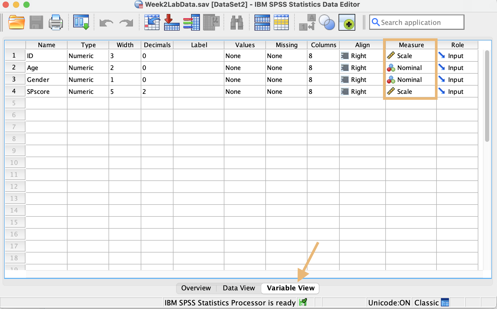
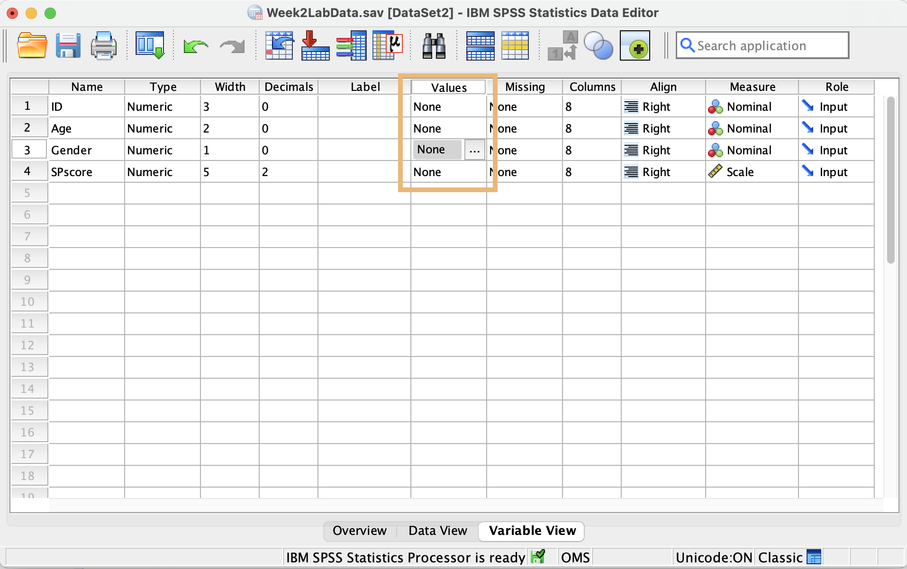
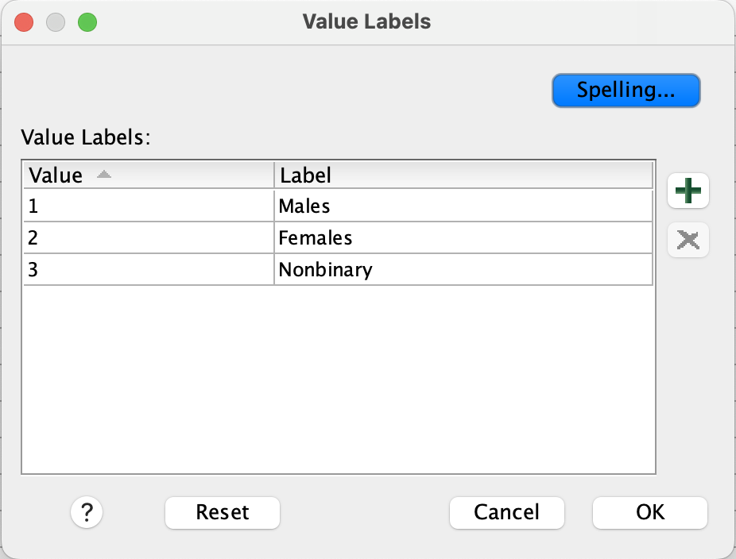

```{r setup, include=FALSE}
library(learnr)
library(knitr)

pacman::p_load('tidyverse', 'rstatix', 'shiny')

baseColor <- '#F28157'
accent1 <- '#F2B66D'
accent2 <- '#30726E'
accent3 <- '#008290'

dat <- read.csv('https://mtruelovehill.github.io/PRM/Labs/Week1LabData.csv')
studentDat <- dat[dat$Role=='Student',]
studentDat$Cperc <- (studentDat$C/50)*100
Cdens <- data.frame(cPerc=density(studentDat$Cperc, from = 0, to = 100)$x, dens=density(studentDat$Cperc, from = 0, to = 100)$y)


```

```{r, context = 'server'}
output$effectSizePlot <- renderPlot({
  
  set.seed(820)
  G1 <- rnorm(as.numeric(input$n), mean = 50, sd = input$sdG1)
  
  testDat <- data.frame(Group = c(rep('G1', as.numeric(input$n)), rep('G2', as.numeric(input$n))),
                        x = c(G1, G1+as.numeric(input$meanDiff)))
  
  pVal <- round(t.test(x~Group, data = testDat)$p.value,3)
  effSize <- as.numeric(round(cohens_d(testDat, x~Group)$effsize,2))
  
  ggplot(data.frame(x=c(15, 85)), aes(x)) +
    geom_histogram(data = testDat[testDat$Group=='G1',], aes(x, y = after_stat(density)), binwidth = 2, fill = accent2, alpha = .8) +
    geom_histogram(data = testDat[testDat$Group=='G2',], aes(x, y = after_stat(density)), binwidth = 2, fill = baseColor, alpha = .8) +
    geom_density(data = testDat[testDat$Group=='G1',], aes(x), color = baseColor, linewidth = 1) +
    geom_density(data = testDat[testDat$Group=='G2',], aes(x), color = accent3, linewidth = 1) +
    scale_x_continuous(limits = c(15, 85), breaks = seq(15, 85, by = 10)) +
    scale_y_continuous(limits = c(0, .15)) +
    theme(axis.text.x = element_text(size = 12),
          axis.title.x = element_text(size = 14, face = 'bold'),
          axis.text.y = element_blank(),
          axis.title.y = element_blank(),
          axis.ticks.y = element_blank()) +
    annotate(geom = 'text', label = paste('Effect Size =', abs(effSize)), x = 25, y = .09, size = 6) +
    annotate(geom = 'text', label = paste('p', ifelse(pVal==0, ' < .001', paste0(' = ', pVal))), 
             x = 25, y = .07, size = 6)
  
})


  observeEvent(input$do, {
    CIs <- data.frame(Sample = 1:20, mean = rep(NA,20), lowBound = rep(NA, 20), hiBound = rep(NA, 20))
    ciDat <- read.csv('https://mtruelovehill.github.io/PRM/Data/ciDat.csv')
    
    for(x in 1:nrow(CIs)) {
      sampDat <- sample(ciDat$Cscore, size = 50)
      margin <- 1.96*sd(sampDat)/sqrt(50)
      CIs$mean[x] <- round(mean(sampDat), 2)
      CIs$lowBound[x] <- mean(sampDat)-margin
      CIs$hiBound[x] <- mean(sampDat)+margin
    }
    
    CIs$plotColors <- ifelse(mean(ciDat$Cscore)>=CIs$lowBound&mean(ciDat$Cscore)<=CIs$hiBound, baseColor, '#D83535')
    
    output$ciPlot <- renderPlot({
      ggplot(CIs, aes(mean, y = Sample)) +
        geom_errorbar(data=CIs, aes(xmin = lowBound, xmax = hiBound, y = Sample), width=0.2, linewidth=1, 
                    color=CIs$plotColors) + 
        geom_point(color = CIs$plotColors) +
        labs(x = 'Score', y = 'Sample Number') +
        scale_x_continuous(limits = c(45, 75), breaks = seq(45, 75, by = 5)) +
        scale_y_continuous(limits = c(1, 20), breaks = seq(0, 20, by = 1)) +
        geom_vline(xintercept = mean(ciDat$Cscore), color = accent3, linewidth = 1) +
        theme(axis.text = element_text(size = 12),
              axis.title = element_text(size = 14, face = 'bold'))
    })
  })
  
```


```{r, echo = F}
tags$style(HTML(".js-irs-0 .irs-single, .js-irs-0 .irs-bar {background: #008290; border-color: transparent}"))
```

## Intro to Today's Lab

During today's lab, you'll apply the concepts discussed during this week's lecture. Each lab consists of a range of tasks, with corresponding questions you can answer. Please note that the questions are not required and not marked, although they do provide a helpful source of formative feedback that will help you gauge your understanding. 

Today, you'll be using interactive visualisations to demonstrate the concepts covered in the lecture. You will also learn some SPSS basics.

### Learning Objectives
At the end of this lab, you will be able to:

1. Describe the difference between effect sizes and $p$-values
2. Compute confidence intervals
3. Describe general requirements of a power analysis
4. Import data and compute basic descriptive statistics using SPSS

## Interpreting Effect Sizes

Although a $p$-value provides you with evidence of whether the null hypothesis can be rejected, it doesn't provide information about the strength of the effect being tested. Even weak relationships may be significant under certain circumstances. Significance does not guarantee an effect is meaningful. To get a better sense of this, we use effect size. 

The plot below shows the distribution of scores for each of two groups, differentiated by color. Use this plot to explore the relationships between means, standard deviations, effect size, sample size, and the $p$-value. While you interact with the plot, consider the following:

+ How does changing the difference between means affect the effect size? The $p$-value?

+ How does changing the standard deviation affect the effect size? The $p$-value?

+ How does changing the sample size affect the effect size? The $p$-value?

**Please note** that due to the way the data are simulated, there will not be a perfect negative or positive relationship between these values. It's more important that you grasp the general trend in their relationship than note the specific values being produced. The answers to the quiz questions will reflect this.

```{r effSizePlot, echo = F}
fluidRow(column(6,
                selectInput('meanDiff', 'Select the Difference between Group Means:', 
                            choices = list('.5' = .5, '1' = 1, '3' = 3, '5' = 5, '10' = 10)),
                selectInput('n', 'Sample Size per Group:', 
                            choices = list('10' = 10, '30' = 50, '100' = 100, '500' = 500, '1000' = 1000, '5000' = 5000)),
                style='padding-left:50px; padding-right:10px; padding-bottom: 0px; padding-top: 0px'),
  column(6, sliderInput('sdG1', 'SD of each group', min=5, max = 10, step = 1, value = 5, ticks = F),
         style='padding-left:50px; padding-right:30px; padding-bottom: 0px; padding-top: 0px'))

plotOutput('effectSizePlot')
```

```{r q5, echo = FALSE}
quiz(caption = 'Test Your Understanding',
     question("If the difference between means and the sample size is held constant, what generally happens to the effect size when the SD is increased?",
              answer('The effect size increases'),
              answer('The effect size decreases', correct = T),
              answer('The effect size stays about the same'),
              message = 'Increasing the standard deviation of will decrease the effect size. This is because the variability in the data is increased.'),
     question("If the group SD and the sample size is held constant, what generally happens to the effect size when the difference between means is increased?",
              answer('The effect size increases', correct = T),
              answer('The effect size decreases'),
              answer('The effect size stays about the same'),
              message = 'Increasing the difference between means indicates a stronger effect of the independent/grouping variable, so the effect size increases.'),
     question("If the difference between means and the group SD is held constant, what generally happens to the effect size when the sample size is increased?",
              answer('The effect size increases'),
              answer('The effect size decreases'),
              answer('The effect size stays about the same', correct = T),
              message = 'Increasing the sample size does not have much of an effect on the effect size.'),
     question("If the difference between means and the group SD is held constant, what generally happens to the p-value when the sample size is increased?",
              answer('The p-value increases'),
              answer('The p-value decreases', correct = T),
              answer('The p-value stays about the same'),
              message = 'Increasing the sample size can also decrease the p-value, causing results to appear more significant even if the effect is quite small.'))
```

## Compute a 95% Confidence Interval 

Recall from the [lecture](https://mtruelovehill.github.io/PRM/Lectures/Week03_NHST_lecture.html#47) that a 95% confidence level indicates that, were we to collect 100 samples and compute 95% confidence intervals each time, ~95 of those confidence intervals would be expected to contain the true population value. 

Here, we'll perform a simulation to illustrate this idea. 

Imagine that you are testing a new measure of social perception in children. You have gathered data from a large sample of children, but for normative purposes, you'd like identify the expected average for the entire population. While it's not possible to know this average without testing every child in the world, it can be estimated using confidence intervals.

```{r q6, echo = F}
quiz(caption = 'Test Your Understanding',
     question("In the above example, which of the following is the sample?",
              answer("Every child in the world"),
              answer("The children who provided data", correct = T),
              message = 'The population refers to anyone to whom the results can be generalised. In this case, it would be every child in the world. The sample refers to the children who provided data.'),
      question("In the above example, which of the following would be considered the population parameter?",
              answer("The mean social perception score of all children in the world", correct = T),
              answer("The mean social perception score for the children who provided data"),
              message = 'The population parameter is the value we are attempting to estimate by using sample data. In this case, it is the mean score of all children in the world.')
     )
```


We often cannot know the true population parameter, but for the purposes of illustration, let's imagine that we have access to the social perception performance of all children in the world, and it looks something like this:

```{r, echo = F, message = F, warning = F}
ciDat <- read.csv('https://mtruelovehill.github.io/PRM/Data/ciDat.csv')

ggplot(ciDat, aes(Cscore)) + geom_histogram(fill = accent3, color = accent2) + 
  xlab('Score') +
  theme(axis.text.x = element_text(size = 12),
          axis.title.x = element_text(size = 14, face = 'bold'),
          axis.text.y = element_blank(),
          axis.title.y = element_blank(),
          axis.ticks.y = element_blank()) +
  annotate('text', label = paste0('Mean = ', round(mean(ciDat$Cscore), 2)), x = 40, y = 700, size = 6)
  
```

```{r q7, echo = F}
quiz(caption = 'Test Your Understanding',
     question_numeric("What is the value of the population parameter in this example? Please round your answer to 2 decimal places.",
              answer(57.97, correct = T),
              message = 'The population parameter is the mean score on the assessment, 57.97.')
     )
```


To demonstrate what the confidence interval tells us, we need to take multiple samples from the population and calculate a confidence interval from each. Given what a 95% confidence interval is telling us, if we were to take 20 separate samples of 50 children and compute a confidence interval with each, we would expect around 19 (95%) of those confidence intervals to include a value of 57.97. 

Use the button to generate 20 new samples. In the plot, the points represent the mean of each sample, and the error bars show the 95% confidence intervals. The true population mean is represented by the green line. Red error bars indicate confidence intervals that do not include the true population mean. If you were to press the button many times, eventually you would find that, on average, 95% of the confidence intervals contain the true population mean of 57.97.

```{r, echo = F}
actionButton("do", "Collect 20 Samples")
plotOutput('ciPlot')
```

You'll also note that while each sample's mean falls near the true population value, it is rare for a sample mean to perfectly capture the population mean. Confidence intervals are useful because they are more likely than the sample mean to capture the population mean.

```{r q8, echo = F}
quiz(caption = 'Test Your Understanding',
     question("Margot conducted a memory test on a sample of students, and found that the mean score was 75 points, with a 95% confidence interval of 65 - 85. Which of the following can she conclude?",
              answer('If Margot were to conduct this test over and over, 95% of the sample would always achieve a score between 65 and 85 points.'),
              answer('There is a .95 probability that the population mean is between 65 and 85 points.'),
              answer('If she calculated the 95% CI using the same method on a large number of samples, 95% of those CIs would contain the population mean. Therefore, she can be 95% confident that her CI of 65-85 contains the population mean.', correct = T),
              answer('She can be 95% confident that her results are accurate.'),
              message = 'The population mean is fixed, so any individual confidence interval that has already been calculated either contains the population mean or does not contain it. However, if you calculate an X% confidence interval on multiple samples, then X% of those intervals will contain the population mean.'))
```

## Power Analyses

When intending to collect primary data, an a priori power analysis should be conducted when designing the study in order to determine the number of participants needed to detect the effect of interest. To run an a priori power analysis, you will need (at minimum) a power threshold, an alpha value, and an estimated effect size. 

When working with secondary data, a sensitivity power analysis can be used to tell you the effect size your sample is capable of detecting, given specific power and alpha values. To run a sensitivity power analysis, you'll need (at minimum) a power threshold, an alpha value, and a sample size.

In this course, we'll be using [WebPower](https://webpower.psychstat.org/wiki/models/index) to conduct power analyses. We'll begin to conduct power analyses when we run specific statistical tests. Today, we'll focus on improving your understanding of the concept of statistical power. Have a look at the following power curves and spend some time trying to interpret them.

```{r, echo = F, fig.width = 8, fig.height=4}

powerDat <- read.csv('https://mtruelovehill.github.io/PRM/Data/powerDat.csv')
powerDat$EffectSize <- factor(powerDat$EffectSize, levels = c('strong', 'moderate', 'weak'))

(powPlot <- ggplot(powerDat, aes(SampleSize, Power, color = EffectSize)) + geom_point() +
  labs(x = 'Sample Size', y = 'Power', color = 'Effect Size') +
  scale_x_continuous(breaks = seq(0, 200, by = 20)) +
  scale_y_continuous(breaks = seq(0, 1, by = .1)) +
  scale_color_manual(values = c(accent2, accent1, baseColor), labels = c('Strong', 'Moderate', 'Weak')) +
  theme(axis.text = element_text(size = 14),
        axis.title = element_text(size = 16, face = 'bold'),
        legend.title = element_text(size = 14, face = 'bold'),
        legend.text = element_text(size = 12)))
```

As you interpret this plot, try to answer the following questions. Recall that power is equal to 1-$\beta$, with $\beta$ being the likelihood of making a Type II error.

+ What is the effect of sample size on power?

+ What is the effect of effect size on power?

+ About how many participants are necessary to detect a moderate effect with 80% power? 

+ If you expect a weak effect but have only 50 participants, what is your likelihood of making a Type II error?

```{r q9, echo = FALSE}
 quiz(caption = 'Test Your Understanding',
      question('What is the traditional threshold for power that is considered acceptable?',
               answer('70%'),
               answer('80%', correct = T),
               answer('90%'),
               answer('100%'),
               message = 'Traditionally, a threshold of 80% is considered an acceptable level of power for a study.'),
      question('Which of the following is not considered when calculating power?',
               answer('Sample variance', correct = T),
               answer('Sample size'),
               answer('Significance level'),
               answer('Effect size'),
               random_answer_order = T,
               message = 'Power is affected by the significance level, sample size, and effect size. Each of these four values is a function of the remaining three.'),
      question('Which of the following would lead to an increase in statistical power? Please select all that apply.',
               answer('Decreasing alpha'),
               answer('Increasing effect size', correct = T),
               answer('Using a two-tailed test instead of a one-tailed test'),
               answer('Increasing the number of participants in the sample', correct = T),
               random_answer_order = T,
               message = 'Power has a positive relationship with all of the given values, so that as effect size, sample size, and alpha increase, so too does power. Decreasing any of these lowers power. Going from a one-tailed to a two-tailed test decreases alpha by splitting it between each tail, so this would also lower power.'),
      question('You run a power analysis and find that, for your analysis, you will need 136 participants to have 80% power to detect a moderate effect (d = .5). Which of the following statements are true? Please select all that apply.',
               answer('If you recruit fewer than 136 participants, your chances of detecting an existing effect will decrease.', correct = T),
               answer('If you recruit at least 136 participants, you have an 80% chance of getting statistically significant results.'),
               answer('If you recruit 136 participants, you have a 20% chance of making a Type II error.', correct = T),
               answer('If the actual effect in the population is weaker than d = .5, 136 participants will still provide sufficient power to detect it.'),
               answer('If the actual effect in the population is stronger than d = .5, 136 participants will still provide sufficient power to detect it.', correct = T),
               random_answer_order = T,
               message = 'You only have an 80% chance of getting statistically significant results IF the effect actually exists. Additionally, reducing the effect size decreases power, so you will need to increase your sample size in order to detect a smaller effect. Increasing the effect size increases power, so you will still be sufficiently powered to detect a larger effect without changing the sample.')
      )
```


<div class="container">
<details><summary><span style = "font-weight: bold; font-size: 16pt"> Click here for a hint </span></summary>

&beta;: the likelihood of making a Type II error

Power = 1 - &beta;

</details>
</div>

</br>

<div class="container">
<details><summary><span style = "font-weight: bold; font-size: 16pt"> Click here for the solution </span></summary>

<i><b> What is the effect of sample size on power? What is the effect of effect size on power? </i></b>

The sample size values can be found on the x-axis of the plot. As these values increase, you can see that power increases as well. Each line represents a different effect size strength. A strong effect size provides more power than a moderate effect size, which provides more power than a weak effect size. 

</br>
<i><b> About how many participants are necessary to detect a moderate effect with 80% power? </i></b>

```{r, echo = F, fig.width=6, fig.height=3}
powPlot + 
  geom_segment(x = 0, xend = 63, y = .8, yend = .8, linetype = 'dashed') +
  geom_segment(x = 63, xend = 63, y = 0, yend = .8, linetype = 'dashed') +
  geom_point(x = 63, y = .8, shape = 8, size = 2)
```

If we check the line associated with moderate strength, we can see that we need about 63 participants to achieve a power of 80%.

</br>

<i><b> If you expect a weak effect but have only 50 participants, what is your likelihood of making a Type II error? </i></b>

```{r, echo = F, fig.width=6, fig.height=3}
powPlot + 
  geom_segment(x = 0, xend = 50, y = .16, yend = .16, linetype = 'dashed') +
  geom_segment(x = 50, xend = 50, y = 0, yend = .16, linetype = 'dashed') +
  geom_point(x = 50, y = .16, shape = 8, size = 2)
```

By checking the line associated with a weak effect size, we can see that 50 participants is associated with a power of about .16. To calculate the chances of making a Type II error using our power value, we need to subtract .16 from 1. This leaves us with .84, meaning we have about an 84% chance of making a Type II error. In other words, we have a high likelihood of failing to identify an existing effect.

</details>
</div>
</br>

## Using SPSS - Accessing Data

In this course, you'll be using SPSS to perform the majority of your tasks. You can download today's data onto your device by <B>[clicking here](https://mtruelovehill.github.io/ISAP/Labs/Week2LabData.sav)</B> or checking this week's folder on [Learn](https://www.learn.ed.ac.uk/ultra/) (requires university login). 

### Your Tasks
+ Download this week's lab data, 'Week2LabData.sav'
+ Move it to your course folder and open it with SPSS.
+ Check each variable's measurement type and correct if necessary

```{r accessData, echo = FALSE}
quiz(caption = 'Check Your Understanding',
     question("Which type of data is SPscore?",
              answer("Categorical"),
              answer("Continuous", correct = T),
              random_answer_order = T,
              message = 'SPscore is a continuous variable. Values on a continuous scale have a meaningful numeric relationship with each other.'),
     question("Which type of data is Gender?",
              answer("Continuous"),
              answer('Categorical', correct = T),
              message = 'Gender is a categorical variable. Categorical data are nominal or ordinal data with no numeric relationship (although they may be represented numerically)'),
     question('Which of the following "Measure" values used by SPSS reflects categorical data? Please select all that apply.',
              answer('Nominal', correct = T),
              answer('Ordinal', correct = T),
              answer('Scale'),
              message = 'Scale can be used for both types of continuous data (ratio and interval scales of measurement), but categorical
              variables are split into nominal and ordinal measures. Remember that nominal data reflect purely independent categories,
              but ordinal data have some sort of implied order (e.g. Likert Scale data, level of education).'))
```

<div class="container">
<details><summary><span style = "font-weight: bold; font-size: 16pt"> Click here for a hint </span></summary>

Check under the **File** tab in SPSS to open the data. Use the *Variable View* in the main data window to adjust each variable's measurement type. Do the labels used by SPSS match the scales of measurement expected (i.e. nominal, ordinal, ratio, interval?) Note that *Scale* is SPSS's label for both ratio and interval data.

</details>
</div>

</br>

<div class="container">
<details><summary><span style = "font-weight: bold; font-size: 16pt"> Click here for the solution </span></summary>
Click *Open* under the **File** tab.  Navigate to the folder where you've stored  'Week2LabData.sav' and select the file. Once data have been imported, check the measure type in the *Variable View* tab:

```{r, echo = F, out.width='75%'}
#knitr::include_graphics('https://mtruelovehill.github.io/PRM/Labs/images/week1_variableView.png')

```

SPSS labels the data as:

* _Nominal:_ data that fall into discrete categories that have no information regarding order (e.g., eye colour)
* _Ordinal:_ data that fall into discrete categories that have some kind of meaningful ordering information (e.g. Likert Scale responses)
* _Scale:_ continuous/numerical data; data have some kind of numeric relationship and could technically be measured to infinite decimal places, if the measurement was actually capable of doing so.


To adjust the measure type, select the Measure box for a single variable and click the arrow that appears.

* **ID** is represented as a number, but there really is no numeric relationship between the numbers (e.g. someone with an ID = 40 didn't complete the study in twice the time of someone with an ID = 20). Technically, the IDs are ordered based on when they completed the study, but because this information isn't meaningful in the context of our analysis, we can consider this a 'Nominal' variable.

* **Age** is continuous. Someone who is 12 is twice as old as someone who is 6, and you could measure age up to infinite decimal places if you had a perfectly precise measurement. This can be considered a 'Scale' variable.

* **Gender** is nominal. It can be captured in discrete categories and there is no inherent order.

* **SPscore** is a 'Scale' variable. There is a meaningful numeric relationship between the values. 

</details>

</div>

</br>

## Using SPSS - Adding Labels to Data

Often, categorical data may be represented as a number. In today's example, the gender variable consists of 3 values which represent the different gender groups that participated in the study. Instead of recording gender as a character label, participants were given a number to reflect their gender group. However, it is important to always include a coding key, so that anyone who works with the data will know how to interpret the numeric labels used and can make appropriate interpretations. SPSS also uses the provided labels in its output, so it can be very helpful when interpreting the results.

### Your Task 
Add a label to the Gender variable so that 1 = 'Male', 2 = 'Female', and 3 = 'Nonbinary'. 

<div class="container">
<details><summary><span style = "font-weight: bold; font-size: 16pt">Click here for a hint </span></summary>

This should also be done in *Variable View*. The column names may seem a bit misleading; you won’t use the ‘Label’ column for this task.

</details>
</div>

</br>

<div class="container">
<details><summary><span style = "font-weight: bold; font-size: 16pt">Click here for the solution </span></summary>

To associate a label with each value of a variable, you'll use the **Values** column under the **Variable View** tab.

Select the Gender x Values cell and click the dots to bring up the _Value Labels_ box. 

```{r, echo = F, out.width='75%'}

# knitr::include_graphics('https://mtruelovehill.github.io/PRM/Labs/images/week1_values.png')
```

Use the $+$ to add a new label. In the Value column, type the value **exactly as it is recorded in your data.** In the Label column, add the label you would like to associate with that specific value. Continue adding labels using  $+$ until you've labeled all values in the Gender column.

```{r, echo = F, out.width='75%'}

# knitr::include_graphics('https://mtruelovehill.github.io/PRM/Labs/images/week1_valueLabs.png')
```

Click 'OK'. If you've done this properly, you'll see that each numeric value is now associated with a character label.


</details>
</div>

</br>

## Using SPSS - Frequency Data

Before doing any sort of analysis, it's important to first check the data to make sure everything is as expected. With categorical data, one way to do this is to inspect the frequency of observations in each group. This allows the following to be checked:

+ Are observations distributed relatively equally or are there major differences across groups?
+ Are there any groups with a limited number of observations?
+ Are there any missing datapoints?

### Your Task 
+ Check the frequency of the Gender variable using a frequency table.

Are any of these groups limited in size? If so, consider how this might this affect your ability to make generalisable claims about this group.

```{r freq, echo = FALSE}
quiz(caption = 'Test Your Understanding',
     question("At least one of the groups is limited in size compared to the others",
              answer("True", correct = T),
              answer("False"),
              message = 'The nonbinary group is much smaller than the other two measured groups.'),
     question_numeric("How many total datapoints do you have for the gender variable?",
              answer(45, correct=T)),
     question_numeric("What percentage of participants are female?",
              answer(42.2, correct=T)),
     question_numeric('How many nonbinary participants are in your sample?',
              answer(2, correct=T)))
```

<div class="container">
<details><summary><span style = "font-weight: bold; font-size: 16pt"> Click here for a hint </span></summary>

You'll find what you need under the *Analyze* tab.

</details>
</div>
</br>

<div class="container">
<details><summary><span style = "font-weight: bold; font-size: 16pt">Click here for the solution </span></summary>
Select Analyze>Descriptives>Frequencies. Select Gender and use the arrow to move it into the Variable box. Make sure 'Display frequency tables' is checked.

</br>

```{r, echo = F, out.width='65%'}
include_graphics('https://mtruelovehill.github.io/PRM/Labs/images/week1_4a.PNG')
```

</br>

**Output:**

```{r, echo = F, out.width='50%'}
include_graphics('https://mtruelovehill.github.io/PRM/Labs/images/week1_4b.PNG')
```

</details>
</div>
</br>

## Visualise Distribution of Data 

Another useful way of visualising the data is to check how your variables are distributed. Depending on the type of data you have, you could use a bar chart or a histogram.

```{r, echo = F, fig.width= 3.5, fig.height=2.5, message=F}
freqDat <- data.frame(Bar=sample(c('Yes', 'No', 'Maybe'), size = 30, replace = T, prob = c(.25, .25, .5)), 
                      Histogram=rnorm(30, mean = 10, sd = 4))

ggplot(freqDat, aes(Bar)) + geom_bar(fill = baseColor, color=accent3) +
  labs(x ='Bar Chart') +
  theme(axis.text = element_blank(),
        axis.ticks = element_blank(),
        axis.title.y = element_blank(),
        axis.title.x = element_text(size = 14, face = 'bold'))

ggplot(freqDat, aes(Histogram)) + geom_histogram(fill = baseColor, color=accent3) +
  theme(axis.text = element_blank(),
        axis.ticks = element_blank(),
        axis.title.y = element_blank(),
        axis.title.x = element_text(size = 14, face = 'bold'))
  
```


### Your Task 
Produce plots to visualise the distribution of each of your variables. Make sure to use the proper plot type given the type of variables you have.

```{r Dist, echo = FALSE}
quiz(caption = 'Test Your Understanding',
     question('Which of the following is appropriate for visualising the frequency distribution of continuous variables?',
              answer('Bar Chart'),
              answer('Histogram', correct = T),
              answer('Both bar charts & histograms can be used for this.'),
              message = 'Histograms should be used to visualise the frequency distribution of a continuous variable. Bar charts should be used to visualise the frequency distribution of a categorical variable.'),
     question("What does the x-axis of a histogram represent?",
              answer("The values of the continuous variable being inspected", correct = T),
              answer("The frequency of each value of the variable being inspected"),
              answer('The levels of a categorical variable being inspected'),
              answer('The normal distribution associated with the variable being inspected'),
              random_answer_order = T),
     question("What does the y-axis of a histogram represent?",
              answer("The values of the continuous variable being inspected"),
              answer("The frequency of each value of the variable being inspected", correct = T),
              answer('The levels of a categorical variable being inspected'),
              answer('The normal distribution associated with the variable being inspected'),
              random_answer_order = T,
              message = 'Histograms should be used with continuous data. The x-axis is the horizontal axis and reflects the values of the variable being inspected. The y-axis reflects the frequency, of each value (or, more often, a range of values) of the plotted variable. The normal curve associated with a specific variable can be plotted as a line overlaying the histogram.'),
     question_numeric("Approximately how many students scored between 40 and 50 on Assessment A?",
              answer(18, correct=T),
              message='You can find this answer by checking the histogram for A. You could also check the frequency table.'))
```

<div class="container">
<details><summary><span style = "font-weight: bold; font-size: 16pt">Click here for a hint </span></summary>

A histogram will allow you to visualise the distribution of continuous variables. Bar plots allow you to check the distribution of categorical data. You'll need to produce a separate plot for each variable.

</details>
</div>
</br>

<div class="container">
<details><summary><span style = "font-weight: bold; font-size: 16pt"> Click here for the solution </span></summary>
<B> For Categorical Variables: </B>

Select *Graphs>Bar*. Select the chart type you'd prefer. When you're checking the distribution of a single variable, you would use a 'Simple' plot.  Use the arrow to add the variable you wish to view to the 'Category Axis' box. When looking at distributions of a categorical variable, you are plotting the total number of participants of each group, so you can leave the 'Bars Represent' portion at the default setting.

```{r, echo = F, out.width='55%'}
include_graphics('https://mtruelovehill.github.io/PRM/Labs/images/week1_5a.PNG')
```

When checking the distribution of categorical variables, check whether all groups are well represented. Consider the questions from the <B>[Frequency Data](#check-frequency-data)</B> portion of this lab.


<B> For Continuous Variables: </B>


Select *Graphs>Histogram*. Use the arrow to add the variable you wish to view to the 'Variable' box.

```{r, echo = F, out.width='55%'}
include_graphics('https://mtruelovehill.github.io/PRM/Labs/images/week1_5b.PNG')
```

Have a look at the output. If a variable is normally distributed, most observations will fall near the mean, while more extreme values are less common.

**Note:** You can also produce both of these plots using *Analyze>Descriptive Statistics>Frequencies* and selecting the Charts option.
</details>
</div>
</br>

## Check Central Tendency

When preparing to perform analysis, one of the most important steps is to check the descriptive statistics of your variables. These values are useful summary metrics and may provide insight into patterns in your data.

### Your Task 
Check the measures of central tendency discussed in class. Make sure to use the proper central tendency measures given the variable type.

+ Are the measures of central tendency similar within a variable?
+ If not, what might this imply?

```{r desc1, echo = FALSE}
quiz(caption = 'Test Your Understanding',
     question("Which of the following central tendency measures could be used to describe age? Please select all that apply.",
              answer("Mean", correct = T),
              answer("Median", correct = T),
              answer('Mode', correct = T),
              message = 'All of the above could technically be used to describe the Age variable. However, it is most common to use the
              mean, as it includes information from each observation.'),
     question("Which of the following central tendency measures could be used to describe gender?",
              answer("Mean"),
              answer("Median"),
              answer('Mode', correct = T),
              message = 'As a categorical variable, there is no numeric relationship between values in the gender variable. Therefore, 
              the mode is the only measure of central tendency that is appropriate to describe this variable'),
     question_numeric("What is the average score on Assessment A?",
              answer(39.10, correct=T)),
     question_numeric("What is the most common age in this sample?",
              answer(19, correct=T)),
     question_numeric("What is the median score on Assessment D?",
              answer(81.87, correct=T))
)
```

<div class="container">
<details><summary><span style = "font-weight: bold; font-size: 16pt">Click here for a hint </span></summary>
Although this is descriptive data, *Analyze>Descriptive Statistics>Descriptives* is not what you need.
</details>
</div>
</br>

<div class="container">
<details><summary><span style = "font-weight: bold; font-size: 16pt"> Click here for the solution </span></summary>
To get all 3 measures of central tendency, you'll need to select *Analyze>Descriptive Statistics>Frequencies*, then put the variables of interest into the 'Variable(s)' box. Click 'Statistics' and select the options for 'Mean', 'Median', and 'Mode', as needed.

```{r, echo = F, out.width='60%'}
include_graphics('https://mtruelovehill.github.io/PRM/Labs/images/week1_6a.PNG')
```

Note that Gender, as a categorical variable, should only be described using Mode. The other variables can be described using all 3 measures.
</details>

</div>

</br>

## Check Measures of Variability

Similar to measures of central tendancy, measures of variability are helpful summary metrics that can provide a sense of how much observations vary within your sample. 

### Your Task 
For all continuous variables, check the measures of variance described in class. These include the maximum, minimum, range, interquartile range, variance, and standard deviation.

```{r desc2, echo = FALSE}
quiz(caption = 'Test Your Understanding',
     question_numeric("What is the IQR for Assessment B?",
              answer(4, correct=T),
              message = "To get the IQR for a variable, you'll need to subtract the 25th percentile from the 75th percentile."),
     question_numeric("What is the maximum score on Assessment C?",
              answer(78, correct=T)),
     question_numeric("What is the standard deviation of scores on Assessment D? Please report your answer to two decimal places.",
              answer(2.15, correct=T))
)
```

<div class="container">
<details><summary><span style = "font-weight: bold; font-size: 16pt">Click here for a hint</summary>
You've already completed the steps to do this. You just need to check different boxes.

</details>
</div>
</br>

<div class="container">
<details><summary><span style = "font-weight: bold; font-size: 16pt"> Click here for the solution </span></summary>
This procedure is identical to getting the measures of central tendency, so in the future, you can do it all at once. You'll need to select *Analyze>Descriptive Statistics>Frequencies*, then put the variables of interest into the 'Variable(s)' box. Click 'Statistics' and select the options needed. For IQR, you'll need to select 'Quartiles':

```{r, echo = F, out.width='60%'}
include_graphics('https://mtruelovehill.github.io/PRM/Labs/images/week1_7a.PNG')
```

Data will be reported in table format in the output. To get the IQR, you'll need to subtract the 25th percentile value from the 75th percentile value.

</details>
</div>
</br>

## Interpret and Report

Now that you've evaluated the assessments, write a paragraph with your results that you could present to the instructor, giving them a suggestion of which assessment they should use in their course. In this paragraph, please do the following: 

+ Describe your sample as you would in a methods section. 

+ Provide a recommendation for which exam the instructor should use in their course, using your results to support your suggestion.

Make sure to use APA style. Once you're finished, compare your paragraph to the solution paragraph. Is there anything you included that is not in the solution? Is there anything you left out? Does your suggestion match the solution paragraph? If not, why not?

</br>
</br>

<div class="container">
<details><summary><span style = "font-weight: bold; font-size: 16pt"> Click here for a hint </span></summary>

<span style = "color:white">You might find the <span style = "color:#9AD079"> [Purdue Owl website](https://owl.purdue.edu/owl/research_and_citation/apa_style/apa_formatting_and_style_guide/general_format.html) </span> helpful for APA formatting. See the participants/sample section in <span style = "color:#9AD079"> [this paper](https://journals.sagepub.com/doi/full/10.1177/0956797620939054) </span> for an example of how you might describe your sample. You can see other examples <span style = "color:#9AD079"> [here](https://journals.sagepub.com/doi/full/10.1177/09567976241231572) </span> and <span style = "color:#9AD079"> [here](https://www.sciencedirect.com/science/article/pii/S0022103123001439)</span>.

</details>
</div>
</br>

<div class="container">
<details><summary><span style = "font-weight: bold; font-size: 16pt"> Click here for the solution </span></summary>

For this analysis, we examined results from 4 different assessments in an attempt to identify the one that most accurately captures the range of student abilities. Each of the 4 assessments was presented 15 students in each of the instructor's 3 courses, providing a total sample of 45 students between ages 17 and 52 ($M$ = 23.04, $SD$ = 7.74; 25 male, 19 female, and 2 nonbinary participants).

Student performance varied widely between the assessments (see Table 1).

**Table 1**

*Assessment Scores - Descriptive Data*

```{r, echo = F, out.width='70%'}

knitr::include_graphics('https://mtruelovehill.github.io/PRM/Labs/images/week1_10a.PNG')

```


As the average score on Assessment A corresponded to a failing mark, this assessment is not recommended. Conversely, the average score on Assessment B was quite high. Additionally, the data exhibited a negative skew. This suggests that there is a ceiling effect, as most students are scoring close to the maximum possible score (see Figure 1).

</br>

**Figure 1**

*Assessment B Scores*

```{r, echo = F, message = F, warning=FALSE}
ggplot(dat, aes(B)) + geom_histogram(fill=baseColor, color = accent3, binwidth = 2) +
  labs(x='Score', y='Count') +
  scale_x_continuous(breaks=seq(0, 100, 10), limits = c(0,100)) +
  theme(axis.title = element_text(size = 16, face = 'bold'),
        axis.text = element_text(size = 14),
        panel.background = element_blank(),
        axis.line = element_line())
```

*Note.* You cannot produce this figure with SPSS. This is just here to show you an example of an appropriate way to report your results with an APA-style figure.

</br>

Assessments D's average was still too high, and the standard deviation of scores was quite small, indicating that it may not be accurately capturing the variability in student comprehension (see Figure 2).

</br>

**Figure 2**

*Assessment D Scores*

```{r, echo = F, message = F, warning=FALSE}
# ggplot(dat, aes(D)) + geom_histogram(fill=baseColor, color = accent3, binwidth = 2) +
#   labs(x='Score', y='Count') +
#   scale_x_continuous(breaks=seq(0, 100, 10), limits = c(0,100)) +
#   theme(axis.title = element_text(size = 16, face = 'bold'),
#         axis.text = element_text(size = 14),
#         panel.background = element_blank(),
#         axis.line = element_line())
```

</br>

Assessment C had a reasonable average, as well as higher variability in the range of scores (see Figure 3). This indicates that, of these assessments, Assessment C may best capture the range of student abilities within the course.

</br>

**Figure 3**

*Assessment C Scores*

```{r, echo = F, message = F, warning=FALSE}
ggplot(dat, aes(C)) + geom_histogram(fill=baseColor, color = accent3, binwidth = 2) +
  labs(x='Score', y='Count') +
  scale_x_continuous(breaks=seq(0, 100, 10), limits = c(0,100)) +
  theme(axis.title = element_text(size = 16, face = 'bold'),
        axis.text = element_text(size = 14),
        panel.background = element_blank(),
        axis.line = element_line())
```

</details>
</div>


</br>
</br>


