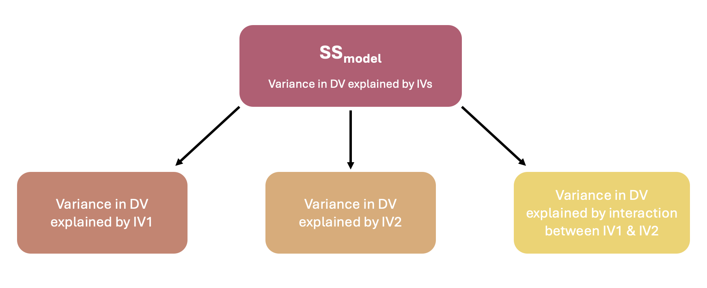
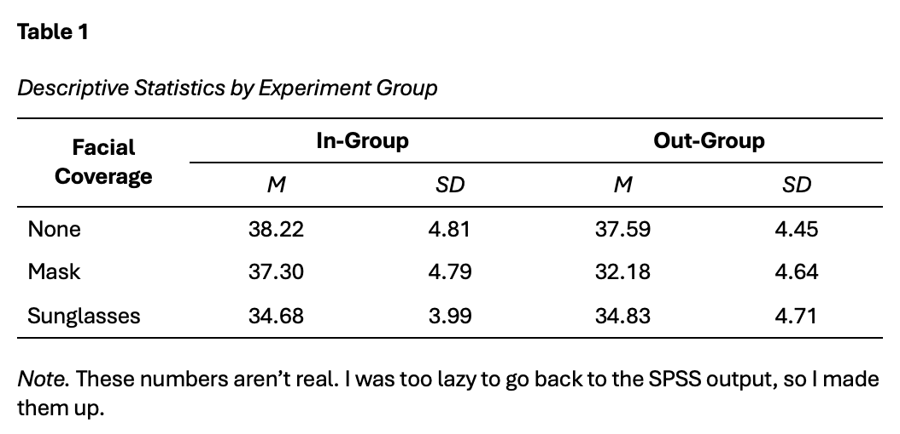

```{r setup, include=FALSE}
options(htmltools.dir.version = FALSE)
```

```{r xaringan-themer, include = FALSE}
library(xaringanthemer)
style_mono_accent(
  base_color = "#F28157",
  header_color = "#000000",
  header_font_google = google_font("Jost"),
  header_font_weight = 500,
  text_font_google = google_font("Jost", "300", "300i", "500", "500i"),
  code_font_google = google_font("Source Code Pro"),
  text_bold_color = '#F28157',
  text_slide_number_color = '#F2B66D',
  text_font_size = '16pt'
)
```

```{r, echo = F, message = F, warning = F}
library(tidyverse)
knitr::opts_chunk$set(dev = 'svg')

baseColor <- '#F28157'
accent1 <- '#F2B66D'
accent2 <- '#30726E'
accent3 <- '#008290'
```

### This Week's Key Topics

+ When to use Factorial ANOVA

+ What is an interaction?

+ Interpreting and reporting the results of Factorial ANOVA

+ Power Analyses with Factorial ANOVAs

---
### Recap from last week

+ ANOVAs can be used to compare more than two means. 

  + One-Way ANOVA tests for differences in the dependent variable between 3 or more levels of a single independent variable. 
  
  + **Factorial (Multiway) ANOVA** tests for differences in the dependent variable across <b>multiple</b> independent variables

--

+ A Factorial ANOVA requires:

  + A continuous dependent variable
  
  + 2 or more categorical independent variables (with at least 2 levels each)

---
### Factorial ANOVA

+ Factorial ANOVAs test for differences in the dependent variable across <b>multiple</b> independent variables

  + Between-Subjects Factorial ANOVA - all IVs are between-subjects 
  
  + Within-Subjects Factorial ANOVA - all IVs are within-subjects
  
  + Mixed Factorial ANOVA - both between- and within-subjects IVs are included in the analysis


---
### Factorial ANOVA

+ Compares the mean of the dependent variable across multiple levels of multiple independent variable

+ When using factorial ANOVA, you can test for both main effects and interactions

  + When multiple independent variables are included in the model, the **main effects** capture the effect of each independent variable, while holding the other independent variable(s) constant.
  
  + The **interaction** captures the how the effect of one independent variable on the dependent variable *changes* across levels of the other independent variable
  
  + This is also known as **moderation**, as the effect between two variables is being moderated by a third.

---
### Main Effects vs Interactions

<br>

.center[
```{r, echo = F, fig.height=5}
intDat <- data.frame(int=c(rep('int1', 4), rep('int2', 4), rep('int3', 4), 
                           rep('meInt', 4), rep('noint', 4)), 
                     IV1 = rep(c('A', 'A', 'B', 'B'), 5), 
                     IV2 = rep(c('A', 'B', 'A', 'B'), 5), 
                     DV = c(4, 2, 2, 4, 2, 2, 2, 4, 3, 4, 2, 2, 3, 4, 2, 4, 2, 1, 4, 3))

ggplot(intDat[intDat$int=='meInt',], aes(IV1, DV, color = IV2, group = IV2)) + geom_point() + geom_line() +
  scale_color_manual(values = c(baseColor, accent2)) +
  scale_y_continuous(limits = c(0,5), breaks = seq(0, 5, by = 1)) +
  labs(x = 'IV 1', y = 'Dependent Variable', color = 'IV 2') +
  theme(legend.position = 'inside',
        legend.position.inside = c(.85, .8),
        axis.text = element_text(size = 12),
        axis.title = element_text(size = 14, face = 'bold'),
        legend.title = element_text(size = 12, face = 'bold'))
```
]

---
### Main Effects vs Interactions

.center[**Main Effect of IV1**

```{r, echo = F, fig.height=5}

mePlot <- ggplot(intDat[intDat$int=='meInt',], aes(IV1, DV, color = IV2, group = IV2)) + 
  geom_point() + geom_line() +
  scale_color_manual(values = c(baseColor, accent2)) +
  scale_y_continuous(limits = c(0,5), breaks = seq(0, 5, by = 1)) +
  labs(x = 'IV 1', y = 'Dependent Variable', color = 'IV 2') +
  theme(legend.position = 'inside',
        legend.position.inside = c(.85, .8),
        axis.text = element_text(size = 12),
        axis.title = element_text(size = 14, face = 'bold'),
        legend.title = element_text(size = 12, face = 'bold'))

mePlot +
  annotate(geom = 'point', x = 1, y = 3.5, shape = 8, size = 4) +
  annotate(geom = 'point', x = 2, y = 3, shape = 8, size = 4) +
  annotate(geom = 'segment', x = 1, xend = 2, y = 3.5, yend = 3, linetype = 2) +
  annotate(geom = 'text', label = 'Difference between IV1 Groups A & B', x = 1.5, y = 3.52) +
  annotate(geom = 'text', label = 'Mean of IV1 \n Group A', x = .85, y = 3.55) + 
  annotate(geom = 'text', label = 'Mean of IV1 \n Group B', x = 2.2, y = 3) 
  
  
```
]

---
### Main Effects vs Interactions

.center[**Main Effect of IV2**

```{r, echo = F, fig.height=5}

mePlot +
  annotate(geom = 'point', x = 1.5, y = 4, shape = 8, size = 4) +
  annotate(geom = 'point', x = 1.5, y = 2.5, shape = 8, size = 4) +
  annotate(geom = 'segment', x = 1.5, xend = 1.5, y = 2.5, yend = 4, linetype = 2) +
  annotate(geom = 'text', label = 'Difference between \n IV2 Groups A & B', x = 1.74, y = 3.25) +
  annotate(geom = 'text', label = 'Mean of IV2 \n Group A', x = 1.5, y = 4.4) +
  annotate(geom = 'text', label = 'Mean of IV2 \n Group B', x = 1.5, y = 2.1) 
```
]

---
### Main Effects vs Interactions

.center[**Interaction**

```{r, echo = F, fig.height=5}
ggplot(intDat[intDat$int=='meInt',], aes(IV1, DV, color = IV2, group = IV2)) + geom_point() + geom_line() +
  scale_color_manual(values = c(baseColor, accent2)) +
  scale_y_continuous(limits = c(0,5), breaks = seq(0, 5, by = 1)) +
  labs(x = 'IV 1', y = 'Dependent Variable', color = 'IV 2') +
  theme(legend.position = 'inside',
        legend.position.inside = c(.85, .8),
        axis.text = element_text(size = 12),
        axis.title = element_text(size = 14, face = 'bold'),
        legend.title = element_text(size = 12, face = 'bold')) + 
  annotate(geom = 'text', label = 'Difference between \n IV2 Groups at IV1A', x = .75, y = 3.5) +
  annotate(geom = 'text', label = 'Difference between \n IV2 Groups at IV1B', x = 2.25, y = 3) +
  annotate(geom = 'segment', x = 1, xend = 1, y = 3, yend = 4, lty = 2) +
  annotate(geom = 'segment', x = 2, xend = 2, y = 2, yend = 4, lty = 2)
  
```
]

---
### Interaction Visualisations

.pull-left[

.center[**Interaction**]
```{r, echo = F, fig.height=3}
ggplot(intDat[intDat$int=='int1',], aes(IV1, DV, color = IV2, group = IV2)) + geom_point() + geom_line() +
  scale_y_continuous(limits = c(0,5), breaks = seq(0, 5, by = 1)) +
  scale_color_manual(values = c(baseColor, accent2)) +
  labs(x = 'IV 1', y = 'Dependent Variable', color = 'IV 2') +
  theme(legend.position = 'inside',
        legend.position.inside = c(.85, .8),
        axis.text = element_text(size = 12),
        axis.title = element_text(size = 14, face = 'bold'),
        legend.title = element_text(size = 12, face = 'bold'))
```
.center[**Interaction**]
```{r, echo = F, fig.height=3}
ggplot(intDat[intDat$int=='int2',], aes(IV1, DV, color = IV2, group = IV2)) + geom_point() + geom_line() +
  scale_color_manual(values = c(baseColor, accent2)) +
  scale_y_continuous(limits = c(0,5), breaks = seq(0, 5, by = 1)) +
  labs(x = 'IV 1', y = 'Dependent Variable', color = 'IV 2') +
  theme(legend.position = 'inside',
        legend.position.inside = c(.85, .8),
        axis.text = element_text(size = 12),
        axis.title = element_text(size = 14, face = 'bold'),
        legend.title = element_text(size = 12, face = 'bold'))
```

]

.pull-right[

.center[**Interaction**]
```{r, echo = F, fig.height=3}
ggplot(intDat[intDat$int=='int3',], aes(IV1, DV, color = IV2, group = IV2)) + geom_point() + geom_line() +
  scale_color_manual(values = c(baseColor, accent2)) +
  scale_y_continuous(limits = c(0,5), breaks = seq(0, 5, by = 1)) +
  labs(x = 'IV 1', y = 'Dependent Variable', color = 'IV 2') +
  theme(legend.position = 'inside',
        legend.position.inside = c(.85, .8),
        axis.text = element_text(size = 12),
        axis.title = element_text(size = 14, face = 'bold'),
        legend.title = element_text(size = 12, face = 'bold'))
```
.center[**No Interaction**]
```{r, echo = F, fig.height=3}
ggplot(intDat[intDat$int=='noint',], aes(IV1, DV, color = IV2, group = IV2)) + geom_point() + geom_line() +
  scale_color_manual(values = c(baseColor, accent2)) +
  scale_y_continuous(limits = c(0,5), breaks = seq(0, 5, by = 1)) +
  labs(x = 'IV 1', y = 'Dependent Variable', color = 'IV 2') +
  theme(legend.position = 'inside',
        legend.position.inside = c(.85, .8),
        axis.text = element_text(size = 12),
        axis.title = element_text(size = 14, face = 'bold'),
        legend.title = element_text(size = 12, face = 'bold'))
```
]

---
### Interpreting Effects

+ Take caution when interpreting main effects in the presence of an interaction. 

.pull-left[

```{r, echo = F, fig.height=4.5}

meDat <- data.frame(Style = rep(c('Alone', 'Alone', 'With Partner', 'With Partner'),2),
                    Method = rep(c('Reading', 'Testing', 'Reading', 'Testing'),2),
                    Score = c(60, 60, 60, 70, 60, 65, 60, 75))

meDat$Method <- factor(meDat$Method, levels = c('Testing', 'Reading'))


ggplot(meDat[1:4,], aes(Style, Score, color = Method, group = Method)) + geom_point() + geom_line() +
  scale_y_continuous(limits = c(50, 80)) +
  scale_color_manual(values = c(baseColor, accent2)) +
  labs(x = 'Style', y = 'Score', color = 'Study Method') +
  theme(legend.position = 'inside',
        legend.position.inside = c(.85, .8),
        axis.text = element_text(size = 12),
        axis.title = element_text(size = 14, face = 'bold'),
        legend.title = element_text(size = 12, face = 'bold'))

```

]

---
### Interpreting Effects

+ Take caution when interpreting main effects in the presence of an interaction. 

.pull-left[

```{r, echo = F, fig.height=4.5}

ggplot(meDat[1:4,], aes(Style, Score, color = Method, group = Method)) + 
  geom_point() + geom_line() +
  scale_y_continuous(limits = c(50, 80)) +
  scale_color_manual(values = c(baseColor, accent2)) +
  labs(x = 'Style', y = 'Score', color = 'Study Method') +
  theme(legend.position = 'inside',
        legend.position.inside = c(.85, .8),
        axis.text = element_text(size = 12),
        axis.title = element_text(size = 14, face = 'bold'),
        legend.title = element_text(size = 12, face = 'bold')) +
  annotate(geom = 'segment', x = 1.5, xend = 1.5, y = 60, yend = 65, linetype = 2) +
  annotate(geom = 'point', x = 1.5, y = 65, shape = 8, size = 4, color = baseColor) +
  annotate(geom = 'point', x = 1.5, y = 60, shape = 8, size = 4, color = accent2) +
  annotate(geom = 'text', label = 'Mean Score of Testing Group', x = 1.95, y = 65, color = baseColor) +
  annotate(geom = 'text', label = 'Mean Score of Reading Group', x = 1.95, y = 59, color = accent2) +
  annotate(geom = 'text', label = 'Main effect of method only due to differences in the partner condition',
           x = 1.5, y = 55)

```
.center[**Main Effect Explained by Interaction**]
]

--

.pull-right[

```{r, echo = F, fig.height=4.5}
ggplot(meDat[5:8,], aes(Style, Score, color = Method, group = Method)) + geom_point() + geom_line() +
  scale_y_continuous(limits = c(50, 80)) +
  scale_color_manual(values = c(baseColor, accent2)) +
  labs(x = 'Style', y = 'Score', color = 'Study Method') +
  theme(legend.position = 'inside',
        legend.position.inside = c(.85, .8),
        axis.text = element_text(size = 12),
        axis.title = element_text(size = 14, face = 'bold'),
        legend.title = element_text(size = 12, face = 'bold')) +
  annotate(geom = 'segment', x = 1.5, xend = 1.5, y = 60, yend = 70, linetype = 2) +
  annotate(geom = 'point', x = 1.5, y = 70, shape = 8, size = 4, color = baseColor) +
  annotate(geom = 'point', x = 1.5, y = 60, shape = 8, size = 4, color = accent2) +
  annotate(geom = 'text', label = 'Mean Score of Testing Group', x = 1.95, y = 70, color = baseColor) +
  annotate(geom = 'text', label = 'Mean Score of Reading Group', x = 1.95, y = 59, color = accent2) +
  annotate(geom = 'text', label = 'Main effect of method across all style conditions',
           x = 1.5, y = 55)
```
.center[**Valid Main Effect AND Interaction**]

]

---
class: inverse, middle, center

## Questions?

---
### Hypotheses

+ Because we have multiple independent variables, we often have multiple hypotheses.

  + Hypotheses about main effects
  
  + Hypothesis about interaction

+ A key consideration when working with tests that produce multiple results is to be sure your research aims and hypotheses align with what your focus in the results and discussion. 

---
### Example Scenario

.pull-left[
+ A researcher investigates how type of facial coverage and stimulus ethnicity affect recognition of facial expressions.

+ **Independent Variables:**
  + Facial Coverage (no coverage/mask/sunglasses)
  + Stimulus Ethnicity (In-Group/Out-Group)

+ **Dependent Variable:** Recognition Score
]

.pull-right[

```{r, echo = F, fig.height=3.5}
facDat <- read.csv('https://mtruelovehill.github.io/ISAP/Data/coverageData.csv', stringsAsFactors = T)
sampDat <- read.csv('https://mtruelovehill.github.io/ISAP/Data/CoverageSampleDat.csv', stringsAsFactors = T)
facDat$Coverage <- as.factor(facDat$Coverage)
facDat$GroupMatch <- as.factor(facDat$GroupMatch)

ggplot(facDat, aes(Coverage, Recognition, fill = GroupMatch)) + geom_boxplot() +
  scale_y_continuous(limits = c(0, 50), breaks = seq(0, 50, 10)) +
  scale_x_discrete(labels = c('None', 'Mask', 'Sunglasses')) + 
  scale_fill_manual(values = c(baseColor, accent1), labels = c('In-Group', 'Out-Group')) +
  labs(fill = 'Group') +
  theme(axis.text = element_text(size = 12),
        axis.title = element_text(size = 14, face = 'bold'),
        legend.position = 'inside',
        legend.position.inside = c(.15, .2))

```


]

---
### Example Scenario

+ The researcher wants to test for 3 possible effects:

  + Is there an effect of facial coverage on expression recognition in children?
  
  + Is there an effect of stimulus ethnicity (in-group/out-group) on expression recognition in children?
  
  + Does the effect of facial coverage on expression recognition differ based on stimulus ethnicity?
  
  
+ All 3 effects can be tested with a single test.

--

** Test Your Understanding:** Which of the above questions reference a main effect and which reference an interaction?

---
### The Logic Behind Factorial ANOVA

+ Recall from last week that ANOVAs evaluate two features in our data:

  + Variance in the dependent variable explained by the independent variable ( $SS_{model}$)
  
  + Variance in the dependent variable *not* explained by the independent variable ( $SS_{residual}$)

--

+ With a Factorial ANOVA, the only difference is that $SS_{model}$ is comprised of the variance from each indepedent variable and their interaction(s):

.center[
```{r, echo = F, out.width='75%'}

```
]

---
### The Logic Behind Factorial ANOVA

.pull-left[
+ Recall that $SS_{model}$ is calculated as the distance between the means of each group and the grand mean. 

+ If there is one IV with 3 groups, this distance is computed between the grand mean and each individual within each of the groups.
]

.pull-right[

```{r, echo = F, fig.height=4, warning = F}


set.seed(526)
dat <- data.frame(IV = c(rep('Group A', 4), rep('Group B', 4), rep('Group C', 4)),
                  DV = c(rnorm(4, mean = 15, sd = 3), rnorm(4, mean = 18, sd = 3), rnorm(4, mean = 12, sd = 3)),
                  ID = 1:12)


basePlot <- ggplot(dat, aes(ID, DV)) + geom_point() +
    labs(x = 'Participant', y = 'Dependent Variable') +
  scale_x_continuous(breaks = seq(1, 12, 1)) + 
    geom_hline(yintercept = mean(dat$DV), linewidth = 1) +
    theme(axis.text = element_text(size = 8),
          axis.title = element_text(size = 8, face = 'bold'))

plotDat <- data.frame(y = c(mean(dat$DV[dat$IV=='Group A']), mean(dat$DV[dat$IV=='Group B']), mean(dat$DV[dat$IV=='Group C'])))

basePlot + geom_point(data = dat, aes(color = IV)) +
  scale_color_manual(values = c(baseColor, accent1, accent2)) +
  geom_segment(aes(x = 1, y = plotDat$y[1], xend = 4, yend = plotDat$y[1]),
               col = baseColor, linewidth = 1) +
  geom_segment(aes(x = 5, y = plotDat$y[2], xend = 8, yend = plotDat$y[2]),
               col = accent1, linewidth = 1) +
  geom_segment(aes(x = 9, y = plotDat$y[3], xend = 12, yend = plotDat$y[3]),
               col = accent2, linewidth = 1) +
  geom_segment(aes(x = ID, y = mean(DV), xend = ID, yend = c(rep(plotDat$y[1], 4), rep(plotDat$y[2], 4), rep(plotDat$y[3], 4)), color = dat$IV), lty = 2, linewidth = 1) +
  theme(legend.position = 'inside',
        legend.position.inside = c(.85, .78),
        legend.text = element_text(size = 8),
        legend.title = element_blank())
```

]

---
### The Logic Behind Factorial ANOVA

.pull-left[
+ When there are multiple IVs, $SS_{model}$ is still calculated as the distance between the means of each group and the grand mean. 

> **Test Your Understanding:** You have 2 between-subjects IVs. One has 2 levels and one has 3 levels. How many total possible groups do you have? 

]

---
### The Logic Behind Factorial ANOVA

.pull-left[
+ When there are multiple IVs, $SS_{model}$ is still calculated as the distance between the means of each group and the grand mean. 

> **Test Your Understanding:** You have 2 between-subjects IVs. One has 2 levels and one has 3 levels. How many total possible groups do you have? 

+ $SS_{model}$ is computed using each of these groups

]

.pull-right[
```{r, echo = F, fig.height=4.5, warning = F}
sampDat$Coverage <- as.factor(sampDat$Coverage)
sampDat$intGroup <- factor(sampDat$intGroup, levels = c('None/InGroup', 'None/OutGroup', 'Mask/InGroup', 'Mask/OutGroup', 'Sunglasses/InGroup', 'Sunglasses/OutGroup'))

plotDat <- as.data.frame(sampDat %>%
  group_by(intGroup) %>%
  summarise(meanRecog = mean(Recognition)))


(ssMod <- ggplot(sampDat, aes(intOrder, Recognition, color = intGroup)) + geom_point() +
  scale_color_manual(values = c(accent3, accent2, baseColor, accent1, '#065473', 'gray34')) +
  scale_x_continuous(breaks = seq(1, 18, 1)) +
   scale_y_continuous(limits = c(0, 50), breaks = seq(0, 50, 10)) + 
  geom_hline(yintercept = mean(sampDat$Recognition), linewidth = 1) +
  geom_segment(aes(x = 1, y = plotDat$meanRecog[1], xend = 3, yend = plotDat$meanRecog[1]),
               col = accent3, linewidth = 1) +
  geom_segment(aes(x = 4, y = plotDat$meanRecog[2], xend = 6, yend = plotDat$meanRecog[2]),
               col = accent2, linewidth = 1) +
  geom_segment(aes(x = 7, y = plotDat$meanRecog[3], xend = 9, yend = plotDat$meanRecog[3]),
               col = baseColor, linewidth = 1) +
  geom_segment(aes(x = 10, y = plotDat$meanRecog[4], xend = 12, yend = plotDat$meanRecog[4]),
               col = accent1, linewidth = 1) +
  geom_segment(aes(x = 13, y = plotDat$meanRecog[5], xend = 15, yend = plotDat$meanRecog[5]),
               col = '#065473', linewidth = 1) +
  geom_segment(aes(x = 16, y = plotDat$meanRecog[6], xend = 18, yend = plotDat$meanRecog[6]),
               col = 'gray34', linewidth = 1) +
  geom_segment(x = sampDat$intOrder, y = mean(sampDat$Recognition), xend = sampDat$intOrder, yend = sampDat$intmean, lty = 2, linewidth = 1) +
  theme(legend.position = 'top',
        axis.title = element_text(face = 'bold'),
        legend.title = element_blank()))

```

]

---
### The Logic Behind Factorial ANOVA

.pull-left.center[

$SS_{IV1}$: Main Effect of Facial Coverage

```{r, echo = F, fig.height=4.5, warning = F}

(covSS <- ggplot(sampDat, aes(ID, Recognition, color = Coverage)) + geom_point() +
  scale_color_manual(values = c(baseColor, accent1, accent2), labels = c('None', 'Mask', 'Sunglasses')) +
  scale_x_continuous(breaks = seq(1, 18, 1)) +
  scale_y_continuous(limits = c(0, 50), breaks = seq(0, 50, 10)) +
  geom_hline(yintercept = mean(sampDat$Recognition), linewidth = 1) +
  geom_segment(x = 1, y = sampDat$V1mean[1], xend = 6, yend = sampDat$V1mean[1],
               col = baseColor, linewidth = 1) +
  geom_segment(x = 7, y = sampDat$V1mean[7], xend = 12, yend = sampDat$V1mean[7],
               col = accent1, linewidth = 1) +
  geom_segment(x = 13, y = sampDat$V1mean[13], xend = 18, yend = sampDat$V1mean[13],
               col = accent2, linewidth = 1) +
  geom_segment(x = sampDat$ID, y = mean(sampDat$Recognition), xend = sampDat$ID, yend = sampDat$V1mean, lty = 2, linewidth = 1) +
  theme(legend.position = 'inside',
        legend.position.inside = c(.9, .2),
        axis.title = element_text(face = 'bold')))

```
]

--

.pull-right.center[

$SS_{IV2}$: Main Effect of Stimulus Group

```{r, echo = F, fig.height=4.5, warning = F}
sampDat$GroupMatch <- as.factor(sampDat$GroupMatch)
(groupSS <- ggplot(sampDat, aes(GroupOrder, Recognition, color = GroupMatch)) + geom_point() +
  scale_color_manual(values = c(accent1, baseColor), labels = c('Consistent/In-Group', 'Inconsistent/Out-Group')) +
  scale_x_continuous(breaks = seq(1, 18, 1)) +
  scale_y_continuous(limits = c(0, 50), breaks = seq(0, 50, 10)) + 
  labs(x = 'ID', color = 'Stimulus Group') +
  geom_hline(yintercept = mean(sampDat$Recognition), linewidth = 1) +
  geom_segment(x = 1, y = sampDat$V2mean[1], xend = 9, yend = sampDat$V2mean[1],
               col = accent1, linewidth = 1) +
  geom_segment(x = 10, y = sampDat$V2mean[4], xend = 18, yend = sampDat$V2mean[4],
               col = baseColor, linewidth = 1) +
  geom_segment(x = sampDat$GroupOrder, y = mean(sampDat$Recognition), xend = sampDat$GroupOrder, yend = sampDat$V2mean, lty = 2, linewidth = 1) +
  theme(legend.position = 'inside',
        legend.position.inside = c(.8, .2),
        axis.title = element_text(face = 'bold')))

```
]

---
### The Logic Behind Factorial ANOVA

.pull-left[

```{r, echo = F, warning = F, fig.height=4, fig.width = 5}
ssMod + theme(legend.position = 'none') +
  annotate(geom = 'text', label = 'SS Model (Variance in DV explained by IVs)', x = 9, y = 10)
```
$SS_{model}$ is the difference between **all possible** group means and the grand mean

]

--

.pull-right[
.center[
$$SS_{model} = SS_{IV1} + SS_{IV2} + SS_{IV1\times IV2}$$
```{r, echo = F}

```
]
]

---
### The Logic Behind Factorial ANOVA

.pull-left[

```{r, echo = F, warning = F, fig.height=4, fig.width = 5}
ssMod + theme(legend.position = 'none') +
  annotate(geom = 'text', label = 'SS Model (Variance in DV explained by IVs)', x = 9, y = 10)
```

So...the interaction effect is computed as:

$$SS_{IV1\times IV2} = SS_{model} - (SS_{IV1} + SS_{IV2})$$

]

.pull-right[

```{r, echo = F, fig.height=2.5, fig.width = 5}
covSS + theme(legend.position = 'none') +
  annotate(geom = 'text', label = 'SS IV1 (Variance in DV explained by Coverage)', x = 9, y = 10)
```

```{r, echo = F, fig.height=2.5, fig.width = 5}
groupSS + theme(legend.position = 'none') +
  annotate(geom = 'text', label = 'SS IV2 (Variance in DV explained by Stimulus Group)', x = 9, y = 10)
```

]


---
### Simple Effects Analysis

.pull-left[
+ While interaction plots help with interpretation, they don't show which differences across levels are significant.

+ Simple effects analyses test the effect of one independent variable at individual levels of the other(s)
]

.pull-right[

```{r, echo = F}
ggplot(facDat, aes(Coverage, Recognition, fill = GroupMatch)) + geom_boxplot() +
  scale_x_discrete(labels = c('None', 'Mask', 'Sunglasses')) +
  scale_y_continuous(limits = c(0, 50), breaks = seq(0, 50, 10)) +
  labs(fill = 'Stimulus Group') +
  scale_fill_manual(values = c(baseColor, accent1), labels = c('In-Group/Consistent', 'Out-Group/Inconsistent')) +
  theme(axis.text = element_text(size = 12),
        axis.title = element_text(size = 14, face = 'bold'),
        legend.position = 'inside',
        legend.position.inside = c(.2, .2))
```


]

---
class: center, inverse, middle

### Questions?

---

### Conducting a Factorial ANOVA

1. State your hypothesis

2. Conduct a power analysis

3. Check your data (visualisations/descriptives)

4. Check assumptions

5. Run the test

6. Calculate the effect size/confidence intervals

7. Interpret results

8. Report

---
### Running a Factorial ANOVA

**Step 1: State Your Hypotheses**

+ 3 hypotheses (2 main effects and 1 interaction):

  + RQ1 - Does facial coverage affect recognition of facial expression?
      + $H_1$ Facial Coverage has an effect on recognition of facial expression
  
  + RQ2 - Is there an effect of stimulus group on recognition of facial expression?
      + $H_1$ Participants are more likely to recognise facial expressions in members of their own ethnic group.
    
  + RQ3 - Does the effect of facial coverage on expression recognition change depending upon stimulus group?
      + $H_1$ The effect of facial coverage on expression recognition depends upon stimulus group.


---
### Running a Factorial ANOVA

+ Main Effects Hypotheses:
  
  + Main Effect of Coverage:
      + $H_0: \mu_{none} = \mu_{mask} = \mu_{sunglasses}$
      + $H_1:$ at least one $\mu$ is different from the other $\mu$s
    
  + Main Effect of Stimulus Group:
      + $H_0: \mu_{consistent} = \mu_{inconsistent}$
      + $H_1: \mu_{consistent} \neq \mu_{inconsistent}$
    
+ Interaction Effect Hypotheses:
      + $H_0: C = 0$
      + $H_1: C \neq 0$

<font size="3"> 
  $C = (\mu_{consistent}\times\mu_{none}-\mu_{consistent}\times\mu_{mask}-\mu_{consistent}\times\mu_{sunglasses}) - (\mu_{inconsistent}\times\mu_{none}-\mu_{inconsistent}\times\mu_{mask}-\mu_{inconsistent}\times\mu_{sunglasses})$ <b> OR </b>
  
  $C = (\mu_{consistent}\times\mu_{none}-\mu_{inconsistent}\times\mu_{none})-(\mu_{consistent}\times\mu_{mask} - \mu_{inconsistent}\times\mu_{mask})-(\mu_{consistent}\times\mu_{sunglasses}-\mu_{inconsistent}\times\mu_{sunglasses})$ 
  </font>


---
### Running a Factorial ANOVA

**Step 2: Conduct a Power Analysis**

+ [WebPower](https://webpower.psychstat.org/wiki/models/index)

+ You should run a power analysis for each effect of interest

> **Test your Understanding:** How many power analyses should you run in this instance?

--

+ Let's run an a priori power analysis to detect effect size

  + These are useful when working with secondary data, where you already have a pre-existing dataset
  
  + Here, you calculate the effect size you can detect with a given sample.
  
  + Our dataset has 120 participants. Check the effect size we have 80% power to detect, given $\alpha$ = .05.

+ Remember, Webpower computes the effect size $f$. We'll need to convert it back to $\eta^2$ using the following formula:

$$\eta^2 = \frac{f^2}{1+f^2}$$

---
### Running a Factorial ANOVA

**Step 3: Check your data**

+ Compute descriptive statistics

+ Look at relevant plots
  
--

+ Open [these data](https://mtruelovehill.github.io/ISAP/Data/coverageData.sav) in SPSS.


---
### Running a Factorial ANOVA

**Step 4: Check Assumptions**

+ **Normality:** Residuals should be normally distributed

--

  + What are residuals, and why should they be normally distributed?
  
--

.center[
```{r, echo = F, warning = F, fig.height=4}
ggplot(sampDat, aes(intOrder, Recognition, color = intGroup)) + geom_point() +
  scale_color_manual(values = c(accent3, accent2, baseColor, accent1, '#065473', 'gray34')) +
  scale_x_continuous(breaks = seq(1, 18, 1)) +
  scale_y_continuous(limits = c(0, 50), breaks = seq(0, 50, 10)) +
  labs(x = 'ID', color = 'Group') +
  geom_hline(yintercept = mean(sampDat$Recognition), linewidth = 1) +
  geom_segment(aes(x = 1, y = plotDat$meanRecog[1], xend = 3, yend = plotDat$meanRecog[1]),
               col = accent3, linewidth = 1) +
  geom_segment(aes(x = 4, y = plotDat$meanRecog[2], xend = 6, yend = plotDat$meanRecog[2]),
               col = accent2, linewidth = 1) +
  geom_segment(aes(x = 7, y = plotDat$meanRecog[3], xend = 9, yend = plotDat$meanRecog[3]),
               col = baseColor, linewidth = 1) +
  geom_segment(aes(x = 10, y = plotDat$meanRecog[4], xend = 12, yend = plotDat$meanRecog[4]),
               col = accent1, linewidth = 1) +
  geom_segment(aes(x = 13, y = plotDat$meanRecog[5], xend = 15, yend = plotDat$meanRecog[5]),
               col = '#065473', linewidth = 1) +
  geom_segment(aes(x = 16, y = plotDat$meanRecog[6], xend = 18, yend = plotDat$meanRecog[6]),
               col = 'gray34', linewidth = 1) +
  geom_segment(x = sampDat$intOrder, y = sampDat$Recognition, xend = sampDat$intOrder, yend = sampDat$intmean, lty = 2, linewidth = 1) +
  theme(legend.position = 'inside',
        legend.position.inside = c(.25, .3),
        axis.title = element_text(face = 'bold'))
```
]


---
### Running a Factorial ANOVA

**Step 4: Check Assumptions**

+ **Normality:** Residuals should be normally distributed
    + Have a look at the histograms & QQ-plots
  
+ **Independence:** Observations/individuals should be sampled independently
    + Consider study design
  
+ **Homogeneity of Variance:** Equal variance between each group/category
    + Visually assess the residuals vs predicted values plot
    + Support this with Levene's Test for between-subjects variables and Mauchly's test for within-subjects variables with > 2 levels


---
### Running a Factorial ANOVA

**Step 5: Run the test**

**Step 6: Calculate the effect size**

**Step 7: Interpret results**

Let's continue in SPSS...


---
### Running a Factorial ANOVA

**Step 8: Report**

We conducted a **2x3 Between-Subjects Factorial ANOVA** to determine the effect of <span style = "color:#F2B66D"> <b> facial coverage (levels: none; mask; sunglasses) </span></b> and <span style = "color:#F2B66D"> <b> stimulus ethnicity (levels: in-group; out-group) </span></b> on <span style = "color:#F2B66D"> <b> facial expression recognition </span></b>. The $\alpha$ threshold was set at .05 for all analyses. An a priori power analysis indicated that 120 participants were sufficient to detect an interaction effect of $\eta^2$ = .08 with a power of 80% and an $\alpha$ threshold of .05.

Facial coverage had a significant effect on expression recognition, <span style = "color:#30726E"><b> $F$(2, 114) = 20.49, $p$ < .001, $\eta^2_p$ = .26 </span></b>. However, stimulus group was not associated with expression recognition, <span style = "color:#30726E"><b> $F$(1, 144) = 0.53, $p$ = .470, $\eta^2_p$ = .005 </span></b>. 

---
### Running a Factorial ANOVA

**Step 8: Report**

There was a significant interaction between facial coverage and stimulus ethnicity on expression recognition, <span style = "color:#008290"><b> $F$(2, 114) = 5.79, $p$ = .004, $\eta^2_p$ = .09 </span></b> (see Figure 1). Simple effects analyses were conducted to probe the interaction. Significant effects were found in both in-group, ** $F$(2, 114) = 9.44, $p$ < .001, $\eta^2_p$ = .14**, and out-group, ** $F$(2, 114) = 16.85, $p$ < .001, $\eta^2$ = .23**, conditions. 

Participants who viewed stimuli whose ethnicity was consistent with their own recognised significantly more expressions in stimuli with no facial coverage than those wearing sunglasses, <span style = "color:#F2B66D"> $p$ < .001. </span> Additionally, they recognised more expressions in those with masks than those with sunglasses, <span style = "color:#F2B66D"> $p$ = .015. </span> There was no difference in recognition when stimuli were wearing masks and when they had no facial coverage, <span style = "color:#F2B66D"> $p$ = .485. </span>

Participants viewing stimuli inconsistent with their ethnicity recognised significantly more expressions when stimuli had no facial coverage, as opposed to when they were wearing masks <span style = "color:#F2B66D"> ( $p$ < .001) </span> or sunglasses <span style = "color:#F2B66D"> ( $p$ < .001) </span>. There was no difference in recognition when stimuli were wearing masks versus when they were wearing sunglasses <span style = "color:#F2B66D"> ( $p$ = .556) </span>.

See Table 1 for descriptive data by group.

---
### Running a Factorial ANOVA

**Step 8: Report**

.pull-left[
.center[**Coverage as Between-Subjects Variable...**]
```{r, echo = F, fig.height=4, fig.width=5}
facDat$intGroup <- as.factor(paste0(facDat$Coverage, facDat$GroupMatch))

ggplot(facDat, aes(Coverage, Recognition, color = GroupMatch)) + 
  stat_summary(fun='mean', geom='point', size = 2) +
  stat_summary(fun.data='mean_se', geom='errorbar', width = .2, linewidth = 1) +
  labs(color = 'Stimulus Group') +
  scale_y_continuous(limits = c(10, 50), breaks = seq(10, 50, 10)) +
  scale_x_discrete(labels = c('None', 'Mask', 'Sunglasses')) +
  scale_color_manual(values = c(accent1, accent3), labels = c('In-Group/Consistent', 'Out-Group/Inconsistent')) +
  theme(
    axis.title = element_text(size = 14, face = 'bold'),
    axis.text = element_text(size = 14),
    legend.position = 'inside',
    legend.position.inside = c(.3, .2)
  )
```
]

.pull-right[
.center[**If Coverage were Within-Subjects...**]
```{r, echo = F, fig.height=4, fig.width=5}
ggplot(facDat, aes(Coverage, Recognition, color = GroupMatch, group = GroupMatch)) + 
  stat_summary(fun='mean', geom='point', size = 2) +
  stat_summary(fun.data='mean_se', geom='errorbar', width = .2, linewidth = 1) +
  stat_summary(fun='mean', geom='line', linewidth = 1) +
  labs(color = 'Stimulus Group') +
  scale_y_continuous(limits = c(10, 50), breaks = seq(10, 50, 10)) +
  scale_x_discrete(labels = c('None', 'Mask', 'Sunglasses')) +
  scale_color_manual(values = c(accent1, accent3), labels = c('In-Group/Consistent', 'Out-Group/Inconsistent')) +
  theme(
    axis.title = element_text(size = 14, face = 'bold'),
    axis.text = element_text(size = 14),
    legend.position = 'inside',
    legend.position.inside = c(.3, .2)
  )
```
]
---
### Running a Factorial ANOVA

**Step 8: Report**

.center[
```{r, echo = F, out.width='50%'}

```
]


---
class: center, inverse, middle

## Questions?

---

.center[
```{r, echo = F, out.width='50%'}

```
]


