```{r setup, include=FALSE}
options(htmltools.dir.version = FALSE)
```

```{r xaringan-themer, include = FALSE}
library(xaringanthemer)
style_mono_accent(
  base_color = "#F28157",
  header_color = "#000000",
  header_font_google = google_font("Jost"),
  header_font_weight = 500,
  text_font_google = google_font("Jost", "300", "300i", "500", "500i"),
  code_font_google = google_font("Source Code Pro"),
  text_bold_color = '#F28157',
  text_slide_number_color = '#F2B66D',
  text_font_size = '16pt'
)
```

```{r, echo = F, message = F, warning = F}
library(tidyverse)
library(kableExtra)

knitr::opts_chunk$set(dev = 'svg')

baseColor <- '#F28157'
accent1 <- '#F2B66D'
accent2 <- '#30726E'
accent3 <- '#008290'
```

### This Week's Key Topics

+ Moderation vs mediation

+ Direct, indirect, and total effects

+ Steps of mediation

+ Interpreting and reporting the results of a mediation analysis


---
### Review of Previous Models

.pull-left[
Model with a single IV:

```{r, echo = F, fig.align= 'center'}

```
]

--

.pull-right[
Model with multiple IVs:
```{r, echo = F, fig.align= 'center'}
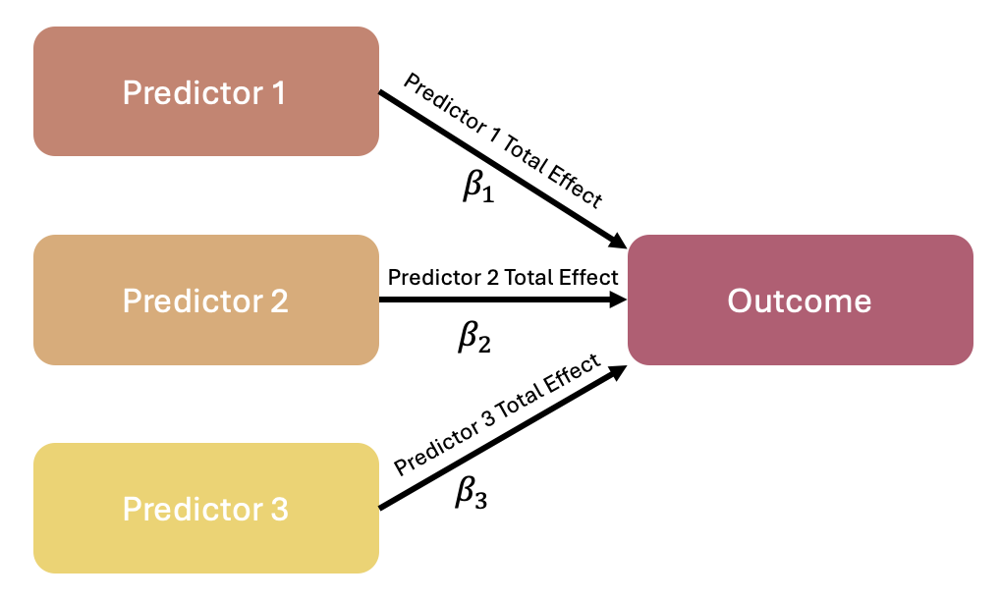
```
]

---
### Review of Previous Models

.pull-left[
Moderation/Interaction between 2 predictors/IVs:
```{r, echo = F, fig.align= 'center'}
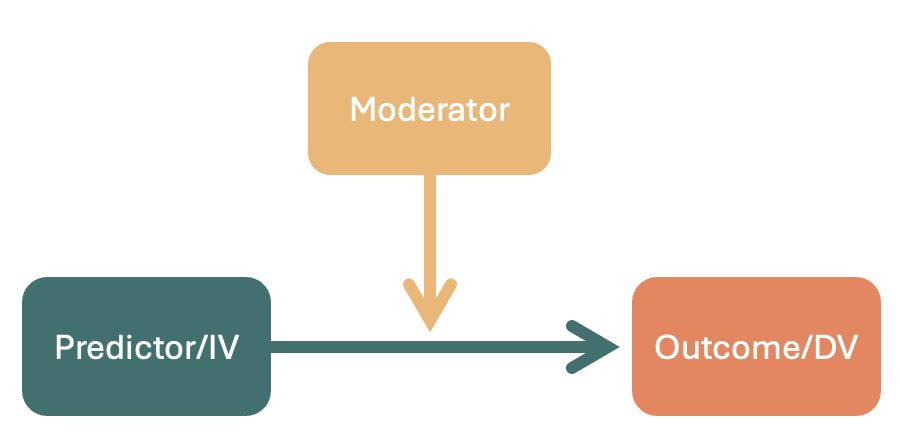
```

<b>Total effect</b> = Effect of Predictor A + Effect of Predictor B + Interaction between A & B
]

--

.pull-right[
When an interaction occurs:

+ The effect of <span style = "color:#30726E"><b>Predictor A</b></span> on the <span style = "color:#F28157"><b>outcome</b></span> <i> changes</i> based on the value of <span style = "color:#F2B66D"><b>Predictor B</b></span>.

+ <span style = "color:#30726E"><b>Predictor A</b></span> has a direct association with the <span style = "color:#F28157"><b>outcome</b></span>, but the strength and direction of this association varies depending on <span style = "color:#F2B66D"><b>Predictor B</b></span>.

]

---
### Introduction to Mediation

.pull-left[
```{r, echo = F, fig.align= 'center'}
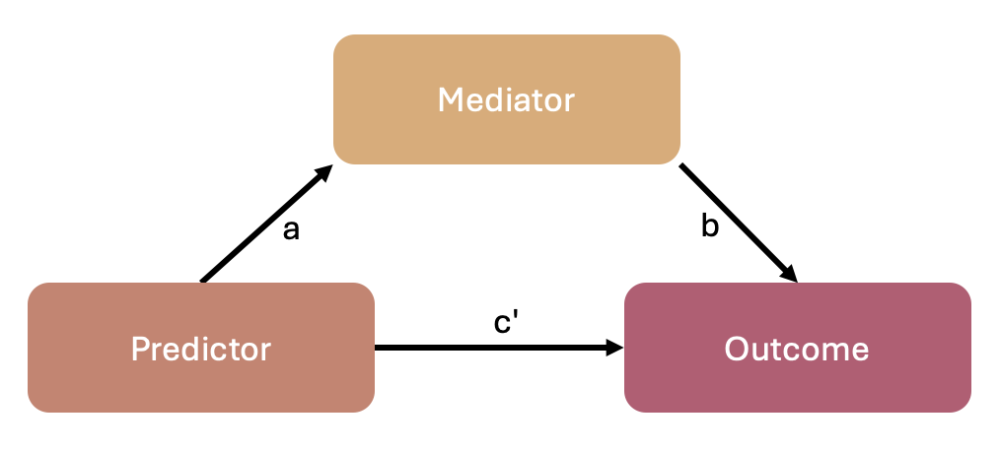
```
]

--

.pull-right[
When mediation occurs:

+ The effect of the <span style = "color:#30726E"><b>predictor</b></span> on the <span style = "color:#F28157"><b>outcome</b></span> is (at least partially) <i> through </i> the <span style = "color:#F2B66D"><b>mediator</b></span>.

+ The <span style = "color:#30726E"><b>predictor</b></span> may have some direct association with the <span style = "color:#F28157"><b>outcome</b></span>, but it also may not; the relationship may be entirely explained by the <span style = "color:#F2B66D"><b>mediator</b></span>.

]

---
### Introduction to Mediation

.pull-left[
```{r, echo = F, fig.align= 'center'}

```
]

.pull-right[
When mediation occurs:

+ The effect of the <span style = "color:#30726E"><b>predictor</b></span> on the <span style = "color:#F28157"><b>outcome</b></span> is (at least partially) <i> through </i> the <span style = "color:#F2B66D"><b>mediator</b></span>.

+ The <span style = "color:#30726E"><b>predictor</b></span> may have some direct association with the <span style = "color:#F28157"><b>outcome</b></span>, but it also may not; the relationship may be entirely explained by the <span style = "color:#F2B66D"><b>mediator</b></span>.

$$Proportion\ Mediated = \frac{effect\ via\ mediator}{total\ effect\ on\ outcome}$$
+ Larger mediating effects suggest that a greater proportion of the relationship between the predictor on the outcome is explained by the mediator (rather than the predictor itself)

]

---
### Key Mediation Effects

.pull-left[

```{r, echo = F, fig.align= 'center'}
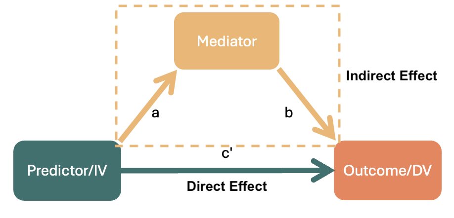
```

.center[
**Total Effect = Indirect Effect + Direct Effect**
]]

.pull-right[

+ **Total:** The full effect of the predictor on the outcome 
$$a*b + c'$$
]
---
### Key Mediation Effects

.pull-left[

```{r, echo = F, fig.align= 'center'}

```

.center[
**Total Effect = Indirect Effect + Direct Effect**
]]

.pull-right[

+ **Total:** The full effect of the predictor on the outcome 
$$a*b + c'$$

> **Test Your Understanding:** Have a look at the diagram, and compare it to the equation above. Which part of the above equation reflects the direct effect? Which part reflects the indirect effect?

]

---
### Key Mediation Effects

.pull-left[

```{r, echo = F, fig.align= 'center'}

```

]

.pull-right[

+ Total: The full effect of the predictor on the outcome
$$a*b + c'$$

+ **Indirect:** The effect of the predictor on the outcome that is due to the mediator
$$a*b$$

]

---
### Key Mediation Effects

.pull-left[

```{r, echo = F, fig.align= 'center'}

```

]

.pull-right[

+ Total: The full effect of the predictor on the outcome 
$$a*b + c'$$

+ Indirect: The effect of the predictor on the outcome that is due to the mediator 
$$a*b$$

+ **Direct:** The effect of the predictor that's left after the effect of the mediator is accounted for 
$$c'$$

]


---
class: center, inverse, middle

## Questions?

---
### The Logic Behind Mediation Analysis

+ If mediation is present:

  + There should be a relationship between the predictor and the outcome
  + There should be a relationship between the predictor and the mediator
  + The presence of the mediator should weaken the association between the predictor and the outcome.
  
+ These ideas can be tested using regression models
  
--

+ A mediation analysis is a combination of regressions:

$$Mediator\sim \beta_0 + \beta_1Predictor$$
$$Outcome\sim \beta_0 + \beta_1Predictor + \beta_2Mediator$$

---
### Mediation Analysis: Under the Hood

.pull-left[
+ Recall that the direct effect is the effect of the predictor that's left after the effect of the mediator is accounted for ( $c'$)

+ $c'$ is reflected by $\beta_1$ from the following model:

$$Outcome \sim \beta_0 + \color{#30726E}{\beta_1}Predictor + \beta_2Mediator$$

]

.pull-right[
```{r, echo = F, fig.align= 'center'}
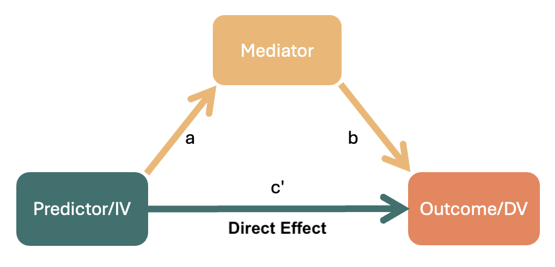
```
]

---
### Mediation Analysis: Under the Hood

.pull-left[
+ The indirect effect is the effect of the predictor that occurs via the mediator ( $a*b$)

+ $a$ is reflected by $\beta_1$ from this model:

$$Mediator \sim \beta_0 + \color{#30726E}{\beta_1}Predictor$$
+ $b$ is reflected by $\beta_2$ from this model:
$$Outcome \sim \beta_0 + \beta_1Predictor + \color{#30726E}{\beta_2}Mediator$$

]

.pull-right[
```{r, echo = F, fig.align= 'center'}

```
]

---
### In-Class Example

.pull-left[

You can download the data for today's example [here](https://mtruelovehill.github.io/ISAP/Data/parentalConflict.sav).

+ `Conflict`: Conflict in the household; higher numbers = more conflict

+ `MalCope`: Maladaptiveness of child's coping mechanisms; higher numbers = more maladaptive

+ `Anx`: Child's anxiety levels; higher numbers = higher anxiety
]

.pull-right[

```{r, echo = F, fig.align= 'center'}
knitr::include_graphics('images/mediationExample.png')
```

]
---
### Path C'

.pull-left[

```{r, echo = F, fig.align= 'center'}
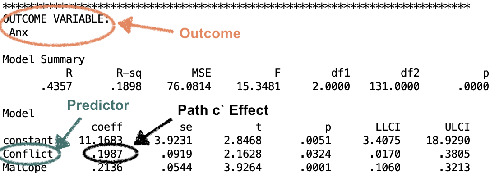
```

]

.pull-right[

```{r, echo = F, fig.align= 'center'}
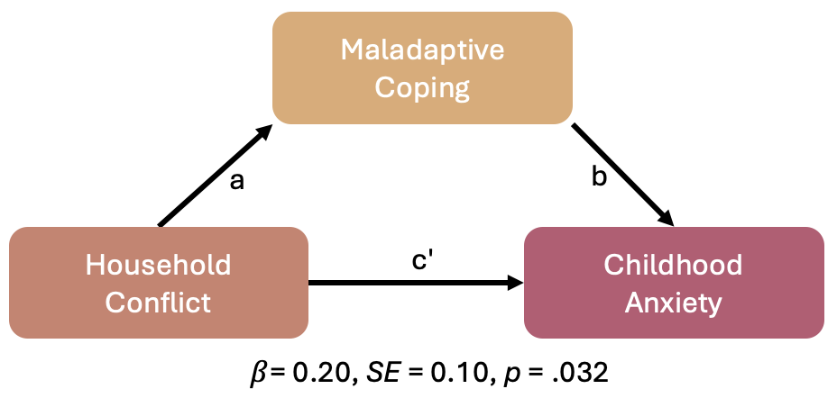
```

]

---
### Path A

.pull-left[

```{r, echo = F, fig.align= 'center'}
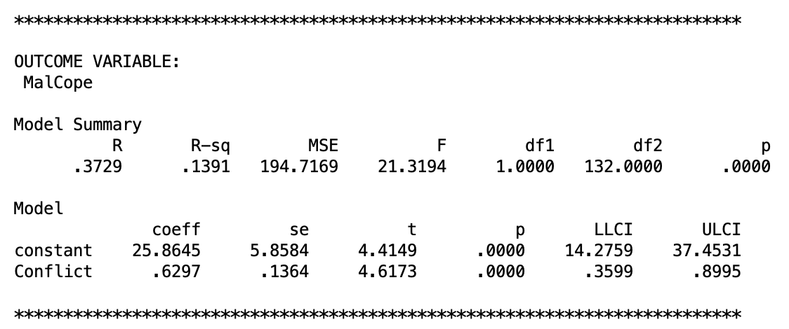
```

]

.pull-right[

```{r, echo = F, fig.align= 'center'}
knitr::include_graphics('images/pathAEffect.png')
```

]

---
### Path B

.pull-left[

```{r, echo = F, fig.align= 'center'}
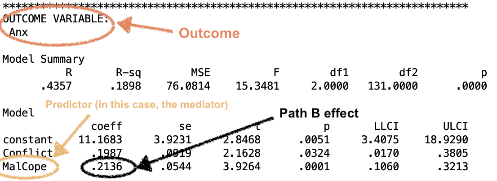
```

]

.pull-right[

```{r, echo = F, fig.align= 'center'}
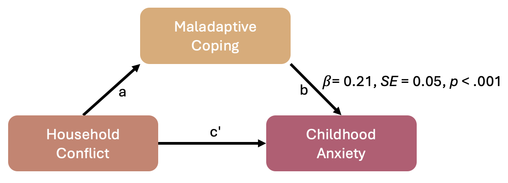
```

]

---
### Direct Effect - c'

.pull-left[

```{r, echo = F, fig.align= 'center'}

```

]

.pull-right[

```{r, echo = F, fig.align= 'center'}
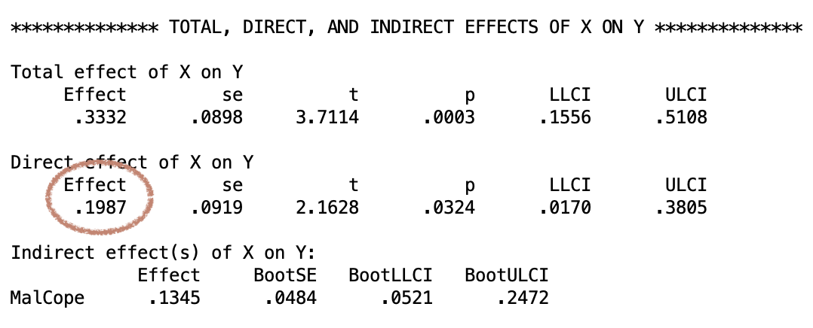
```

]
---
### Indirect Effect - $a\times b$

.pull-left[

```{r, echo = F, fig.align= 'center'}

```

```{r, echo = F, fig.align= 'center'}

```

]

.pull-right[

```{r, echo = F, fig.align= 'center'}
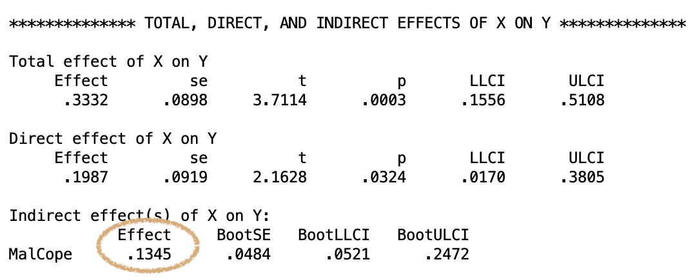
```

$.6297 \times .2136 = .1345$

]

---
### Total Effect - $a \times b + c'$


$$.1345 + .1987 = .3332$$

```{r, echo = F, fig.align= 'center', out.width='65%'}
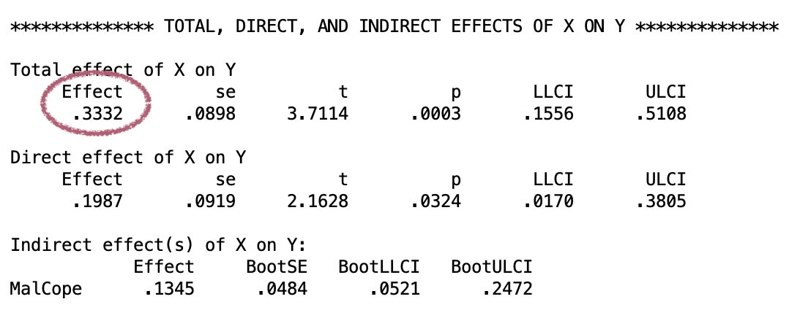
```

---
### Interpreting mediation results

+ The **direct** effect: the increase in the outcome that occurs with a one-unit increase in the predictor *over and above* the increase that occurs via the mediator

+ The **indirect** effect: the increase in the outcome that occurs via the mediator when the predictor increases by one unit. 

+ The **total** effect: the increase in the outcome expected to occur when the predictor increases by one unit. 

---
class: middle, center, inverse

## Questions?

---
### Interpreting the Indirect Effect

.pull-left[

+ The indirect effect of the mediation analysis is evaluated using bootstrapped confidence intervals rather than a $p$-value 

+ **Bootstrapping:** A statistical technique through which a parameter is estimated through the use of random resampling from a sample

]


.pull-right[
```{r, echo = F, fig.align= 'center'}

```
]

---
### A Quick Run-Through of Bootstrapping

+ Bootstrapping treats the sample as a population, and takes multiple samples from it

+ From these samples, a confidence interval for the desired parameter can be computed

--

.pull-left[
```{r, echo = F, fig.align= 'center'}
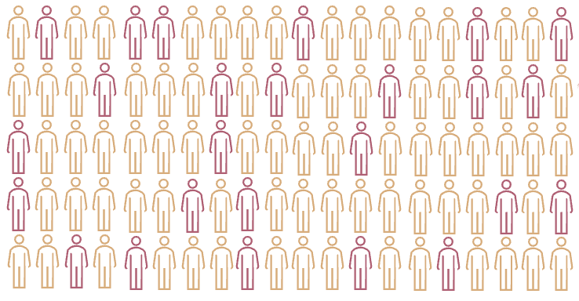
```
Imagine you have this sample.

]

---
### A Quick Run-Through of Bootstrapping

+ Bootstrapping treats the sample as a population, and takes multiple samples from it

+ From these samples, a confidence interval for the desired parameter can be computed

.pull-left[
```{r, echo = F, fig.align= 'center'}
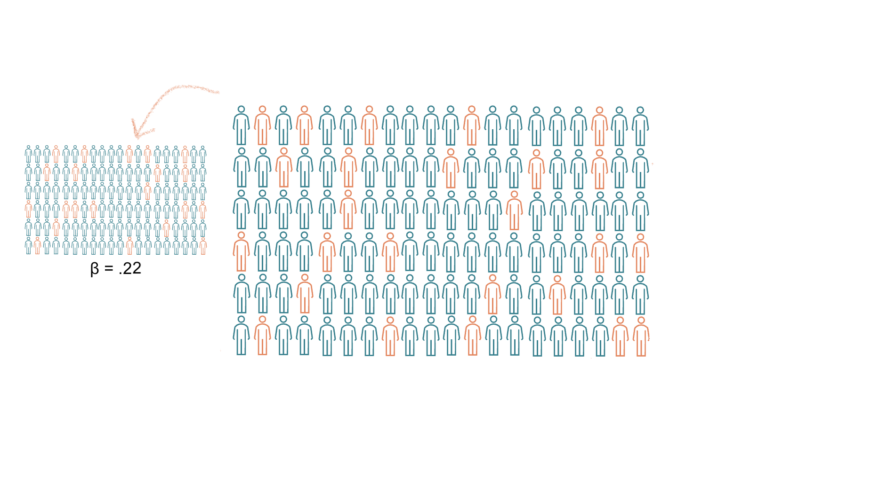
```
To bootstrap, you take a new sample with the same $n$, using **resampling**
]


.pull-right[

```{r, echo = F, fig.align= 'center', warning = F, message = F, fig.height=4}
bootDat <- data.frame(betaVals = c(.22))

ggplot(bootDat, aes(betaVals)) + geom_histogram(fill = accent3, color = accent2) + 
  scale_x_continuous(limits = c(.15, .45), breaks = seq(.15, .45, by = .05)) +
  scale_y_continuous(limits = c(0, 30), breaks = seq(0, 30, by = 5)) +
  xlab('beta')
```
...and compute the parameter of interest using the new sample. 

]

---
### A Quick Run-Through of Bootstrapping

+ Bootstrapping resamples treats the sample as a population, and takes multiple samples from it

+ From these samples, a confidence interval for the desired parameter can be computed

.pull-left[
```{r, echo = F, fig.align= 'center'}
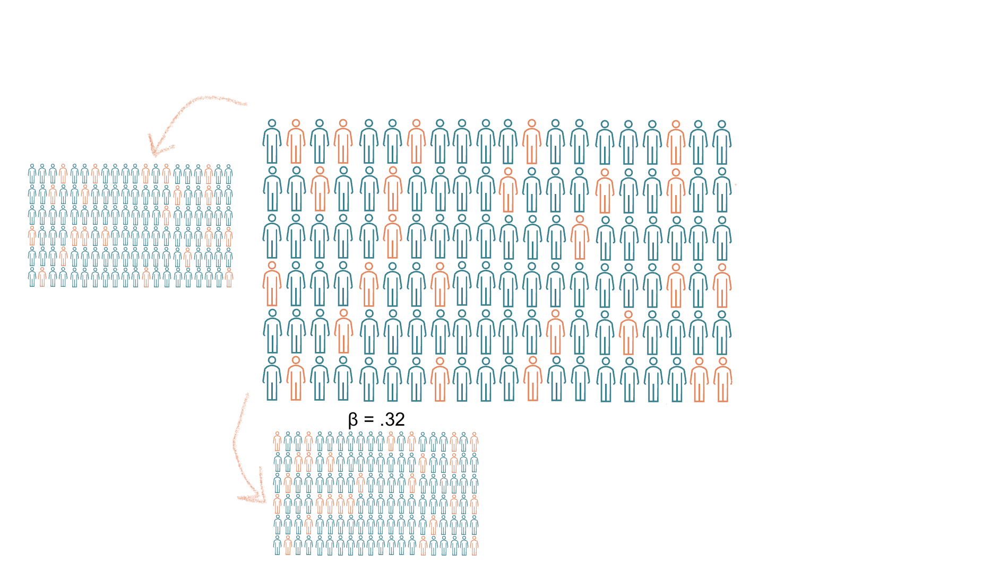
```
You do this over and over...
]

.pull-right[

```{r, echo = F, fig.align= 'center', warning = F, message = F, fig.height=4}
bootDat <- data.frame(betaVals = c(.22, .32))

ggplot(bootDat, aes(betaVals)) + geom_histogram(fill = accent3, color = accent2) + 
  scale_x_continuous(limits = c(.15, .45), breaks = seq(.15, .45, by = .05)) +
  scale_y_continuous(limits = c(0, 30), breaks = seq(0, 30, by = 5)) +
  xlab('beta')
```
...and compute the parameter of interest each time.

]

---
### A Quick Run-Through of Bootstrapping

+ Bootstrapping resamples treats the sample as a population, and takes multiple samples from it

+ From these samples, a confidence interval for the desired parameter can be computed

.pull-left[

```{r, echo = F, fig.align= 'center'}
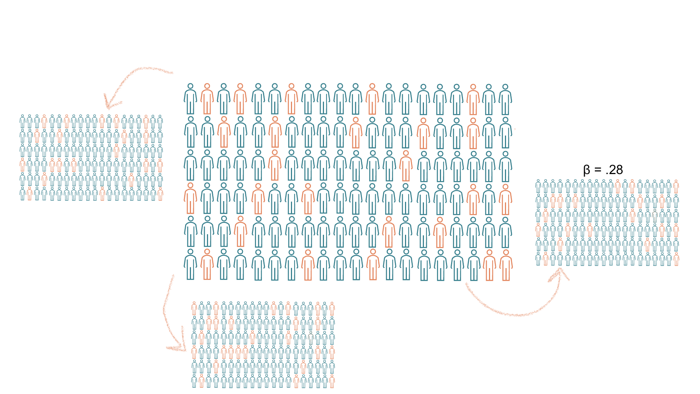
```
You do this over and over...
]

.pull-right[

```{r, echo = F, fig.align= 'center', warning = F, message = F, fig.height=4}
bootDat <- data.frame(betaVals = c(.22, .32, .28))
#.30

ggplot(bootDat, aes(betaVals)) + geom_histogram(fill = accent3, color = accent2) + 
  scale_x_continuous(limits = c(.15, .45), breaks = seq(.15, .45, by = .05)) +
  scale_y_continuous(limits = c(0, 30), breaks = seq(0, 30, by = 5)) +
  xlab('beta')
```
...and compute the parameter of interest each time.

]

---
### A Quick Run-Through of Bootstrapping

+ Bootstrapping resamples treats the sample as a population, and takes multiple samples from it

+ From these samples, a confidence interval for the desired parameter can be computed

.pull-left[
```{r, echo = F, fig.align= 'center'}
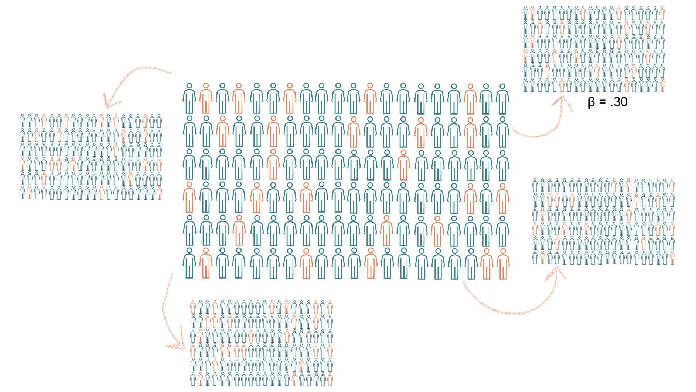
```
You do this over and over...
]

.pull-right[

```{r, echo = F, fig.align= 'center', warning = F, message = F, fig.height=4}
bootDat <- data.frame(betaVals = c(.22, .32, .28, .30))

ggplot(bootDat, aes(betaVals)) + geom_histogram(fill = accent3, color = accent2) + 
  scale_x_continuous(limits = c(.15, .45), breaks = seq(.15, .45, by = .05)) +
  scale_y_continuous(limits = c(0, 30), breaks = seq(0, 30, by = 5)) +
  xlab('beta')
```
...and compute the parameter of interest each time.

]

---
### A Quick Run-Through of Bootstrapping


```{r, echo = F, fig.align= 'center', message = F, warning = F, fig.height=4}
set.seed(405)
bootDat <- data.frame(betaVals = rnorm(500, mean = .3, sd = .1))

(bootDist <- ggplot(bootDat, aes(betaVals)) + geom_histogram(fill = accent3, color = accent2) + 
  labs(x = 'beta', y = 'Count') +
  scale_x_continuous(limits = c(0, .6), breaks = seq(0, .6, by = .05)) + 
  scale_y_continuous(limits = c(0, 50), breaks = seq(0, 50, by = 10)))
```

+ This process is repeated over and over until there is a distribution of your parameter of interest:


---
### A Quick Run-Through of Bootstrapping


```{r, echo = F, fig.align= 'center', message = F, warning = F, fig.height=4}
qts <- round(quantile(bootDat$betaVals, probs = c(0.05, .95)),2)

bootDist +
  geom_vline(xintercept = qts[1], color = accent1, linewidth = 1, lty = 2) +
  geom_vline(xintercept = qts[2], color = accent1, linewidth = 1, lty = 2) +
  annotate(geom = 'text', label = paste0('95% CI = [', qts[1], ', ', qts[2], ']'), x = 0.3, y = 50)

```

+ This process is repeated over and over until there is a distribution of your parameter of interest:

+ From this distribution, the confidence interval can be computed.

---
class: inverse, middle, center

## Questions?

---
### Conducting a Mediation Analysis

1. State your hypothesis

2. Power analysis
  
3. Check your data

4. Check assumptions
  
5. Run the test

6. Interpret results

7. Report

---
### State your hypothesis

+ As before, the hypothesis should name all relevant variables:

+ E.g. 'The effect of X (predictor) on Y (outcome) is mediated by M (mediator).'

--

+ Statistically, you are still investigating $\beta$ values.

+ With mediation, the key result of interest is the indirect effect:

$$\beta_{indirect} \neq 0$$
---
### Power Analysis

+ Often done through data simulation & bootstrapping

  + Beyond the scope of this course, but click [here](https://nickch-k.github.io/EconometricsSlides/Week_08/Power_Simulations.html) if you'd like an overview.

+ Have a look at [Fritz & MacKinnon (2007)](https://pmc.ncbi.nlm.nih.gov/articles/PMC2843527/) for guidance around target sample sizes for different effect size thresholds.

---
### Check Assumptions

+ Basic mediation models have the same assumptions as linear regression

+ These assumptions can be checked on the individual regression models that comprise the mediation analysis

+ We can continue in SPSS using [these data](https://mtruelovehill.github.io/ISAP/Data/parentalConflict.sav)

---
class: middle, inverse, center

## Questions?

