```{r setup, include=FALSE}
options(htmltools.dir.version = FALSE)
```

```{r xaringan-themer, include = FALSE}
library(xaringanthemer)
style_mono_accent(
  base_color = "#CD826E",
  header_color = "#000000",
  header_font_google = google_font("Jost"),
  header_font_weight = 500,
  text_font_google = google_font("Jost", "300", "300i", "500", "500i"),
  code_font_google = google_font("Source Code Pro"),
  text_bold_color = '#CD826E',
  text_slide_number_color = '#DFAA73',
  text_font_size = '16pt'
)
```

```{r, echo = F, message = F, warning = F}
library(tidyverse)
library(kableExtra)

knitr::opts_chunk$set(dev = 'svg')

baseColor <- '#CD826E'
accent1 <- '#BB5A73'
accent2 <- '#DFAA73'
accent3 <- '#F0D264'
```

### This Week's Key Topics

+ Moderation vs mediation

+ Direct, indirect, and total effects

+ Steps of mediation

+ Interpreting and reporting the results of a mediation analysis


---
### Review of Previous Models

.pull-left[
Model with a single IV:

```{r, echo = F, fig.align= 'center'}

```
]

--

.pull-right[
Model with multiple IVs:
```{r, echo = F, fig.align= 'center'}
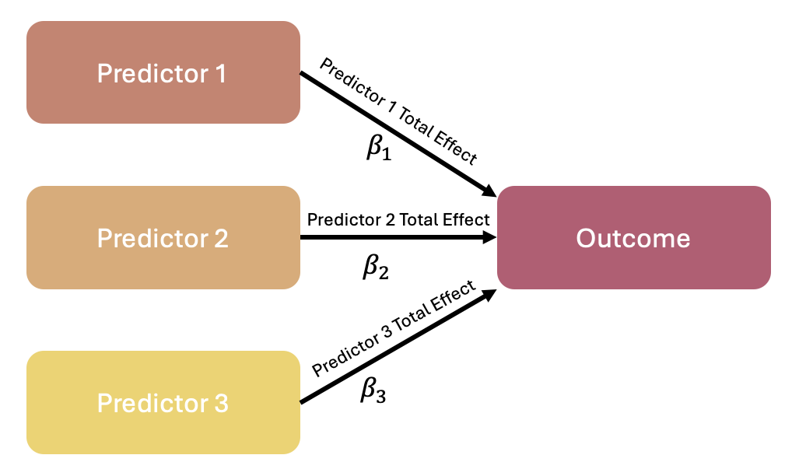
```
]

---
### Review of Previous Models

Moderation/Interaction between 2 predictors:

<b>Total effect</b> = Effect of Predictor A + Effect of Predictor B + Interaction between A & B

.pull-left[

```{r, echo = F, fig.align= 'center'}
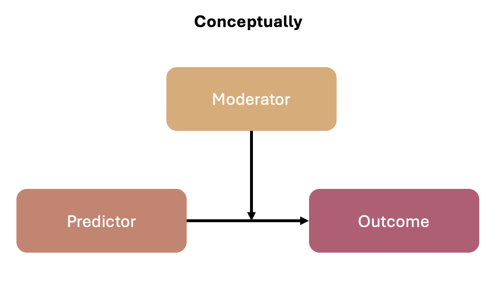
```

]


.pull-right[

```{r, echo = F, fig.align= 'center'}
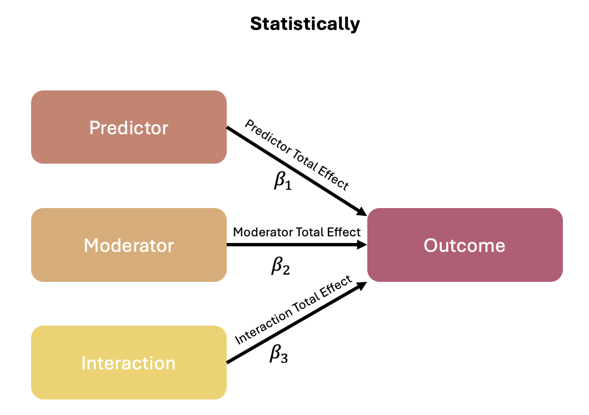
```

]

---
### Review of Previous Models

Moderation/Interaction between 2 predictors:

<b>Total effect</b> = Effect of Predictor A + Effect of Predictor B + Interaction between A & B


.pull-left[
When an interaction occurs:

+ The effect of <span style = "color:#CD826E"><b>Predictor A</b></span> on the <span style = "color:#BB5A73"><b>outcome</b></span> <i> changes</i> based on the value of <span style = "color:#DFAA73"><b>Predictor B</b></span>.

+ <span style = "color:#CD826E"><b>Predictor A</b></span> has a direct association with the <span style = "color:#BB5A73"><b>outcome</b></span>, but the strength and direction of this association varies depending on <span style = "color:#DFAA73"><b>Predictor B</b></span>.
]

.pull-right[

```{r, echo = F, fig.align= 'center'}

```


]
---
### Introduction to Mediation

.center[
```{r, echo = F, out.width='50%'}
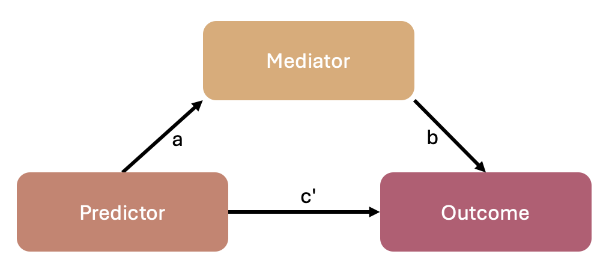
```
]

--

When mediation occurs:

+ The effect of the <span style = "color:#CD826E"><b>predictor</b></span> on the <span style = "color:#BB5A73"><b>outcome</b></span> is (at least partially) <i> through </i> the <span style = "color:#DFAA73"><b>mediator</b></span>.

+ The <span style = "color:#CD826E"><b>predictor</b></span> may have some direct association with the <span style = "color:#BB5A73"><b>outcome</b></span>, but it also may not; the relationship may be entirely explained by the <span style = "color:#DFAA73"><b>mediator</b></span>.

---
### Introduction to Mediation

```{r, echo = F, fig.align= 'center', out.width='60%'}
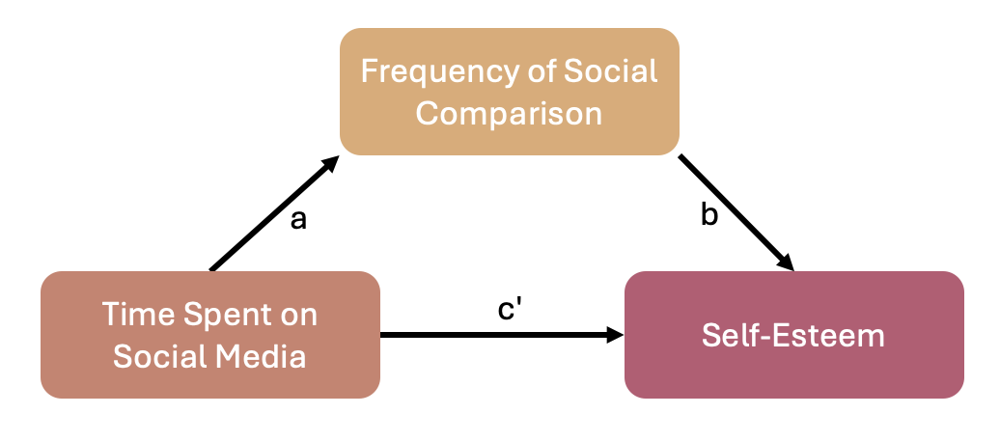
```

--

+ The effect of <span style = "color:#CD826E"><b> the time spent on social media </b></span> on <span style = "color:#BB5A73"><b>adolescent self-esteem</b></span> is (at least partially) <i> through </i> the <span style = "color:#DFAA73"><b>frequency of social comparison</b></span>.

---
### Introduction to Mediation

.pull-left[
```{r, echo = F, fig.align= 'center'}

```
]

.pull-right[

$$Proportion\ Mediated = \frac{effect\ via\ mediator}{total\ effect\ on\ outcome}$$

Larger mediating effects suggest that a greater proportion of the relationship between the predictor on the outcome is explained by the mediator (rather than the predictor itself)

]

---
### Key Mediation Effects

.pull-left[

```{r, echo = F, fig.align= 'center'}
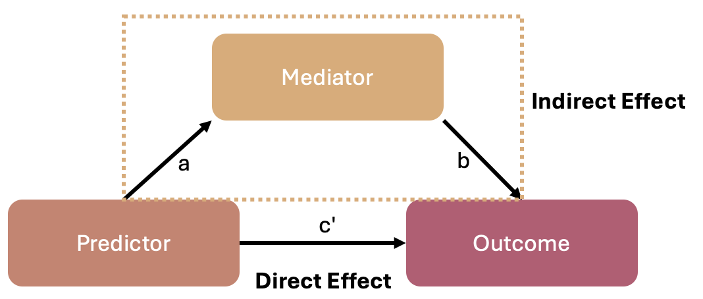
```
]

.pull-right[

+ **Total:** The full effect of the predictor on the outcome 
$$a*b + c'$$
]
---
### Key Mediation Effects

.pull-left[

```{r, echo = F, fig.align= 'center'}

```
]

.pull-right[

+ **Total:** The full effect of the predictor on the outcome 
$$a*b + c'$$

> **Test Your Understanding:** Have a look at the diagram, and compare it to the equation above. Which part of the above equation reflects the direct effect? Which part reflects the indirect effect?

]

---
### Key Mediation Effects

.pull-left[

```{r, echo = F, fig.align= 'center'}

```
.center[
**Total Effect = Indirect Effect + Direct Effect**
]
]

.pull-right[

+ Total: The full effect of the predictor on the outcome
$$a*b + c'$$

+ **Indirect:** The effect of the predictor on the outcome that is due to the mediator
$$a*b$$

]

---
### Key Mediation Effects

.pull-left[

```{r, echo = F, fig.align= 'center'}

```
.center[
**Total Effect = Indirect Effect + Direct Effect**
]
]

.pull-right[

+ Total: The full effect of the predictor on the outcome 
$$a*b + c'$$

+ Indirect: The effect of the predictor on the outcome that is due to the mediator 
$$a*b$$

+ **Direct:** The effect of the predictor that's left after the effect of the mediator is accounted for 
$$c'$$

]


---
class: center, inverse, middle

## Questions?

---
### The Logic Behind Mediation Analysis

+ If mediation is present:

  + There should be a relationship between the predictor and the outcome
  + There should be a relationship between the predictor and the mediator
  + The presence of the mediator should weaken the association between the predictor and the outcome.
  
+ These ideas can be tested using regression models
  
--

+ A mediation analysis is a combination of regressions:

$$Mediator\sim \beta_0 + \beta_1Predictor$$
$$Outcome\sim \beta_0 + \beta_1Predictor + \beta_2Mediator$$

---
### Mediation Analysis: Under the Hood

.pull-left[
+ Recall that the direct effect is the effect of the predictor that's left after the effect of the mediator is accounted for ( $c'$)

+ $c'$ is reflected by $\beta_1$ from the following model:

$$Outcome \sim \beta_0 + \color{#BB5A73}{\beta_1}Predictor + \beta_2Mediator$$

]

.pull-right[
```{r, echo = F, fig.align= 'center'}

```
]

---
### Mediation Analysis: Under the Hood

.pull-left[
+ The indirect effect is the effect of the predictor that occurs via the mediator ( $a*b$)

+ $a$ is reflected by $\beta_1$ from this model:

$$Mediator \sim \beta_0 + \color{#BB5A73}{\beta_1}Predictor$$
+ $b$ is reflected by $\beta_2$ from this model:
$$Outcome \sim \beta_0 + \beta_1Predictor + \color{#BB5A73}{\beta_2}Mediator$$

]

.pull-right[
```{r, echo = F, fig.align= 'center'}

```
]

---
### In-Class Example

.pull-left[

You can download the data for today's example [here](https://mtruelovehill.github.io/ISAP/Data/parentalConflict.sav).

+ `Conflict`: Conflict in the household; higher numbers = more conflict

+ `MalCope`: Maladaptiveness of child's coping mechanisms; higher numbers = more maladaptive

+ `Anx`: Child's anxiety levels; higher numbers = higher anxiety

> **Test Your Understanding:** Fill in the boxes for the mediation model diagram using these variables.
]


--
.pull-right[

```{r, echo = F, fig.align= 'center'}
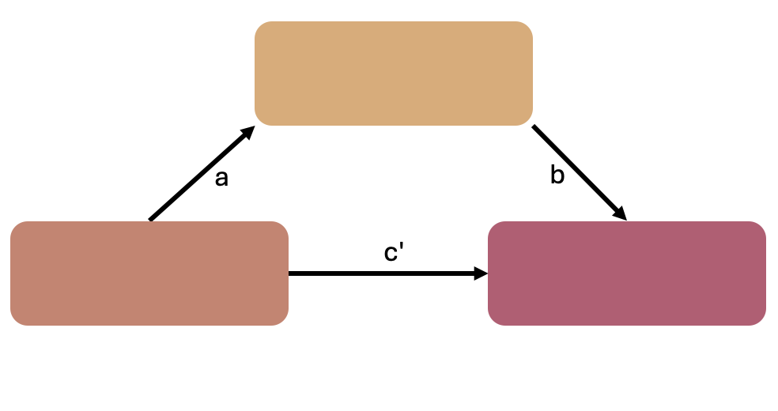
```

]

---
### In-Class Example

.pull-left[

You can download the data for today's example [here](https://mtruelovehill.github.io/ISAP/Data/parentalConflict.sav).

+ `Conflict`: Conflict in the household; higher numbers = more conflict

+ `MalCope`: Maladaptiveness of child's coping mechanisms; higher numbers = more maladaptive

+ `Anx`: Child's anxiety levels; higher numbers = higher anxiety

> **Test Your Understanding:** Fill in the boxes for the mediation model diagram using these variables.
]

.pull-right[

```{r, echo = F, fig.align= 'center'}
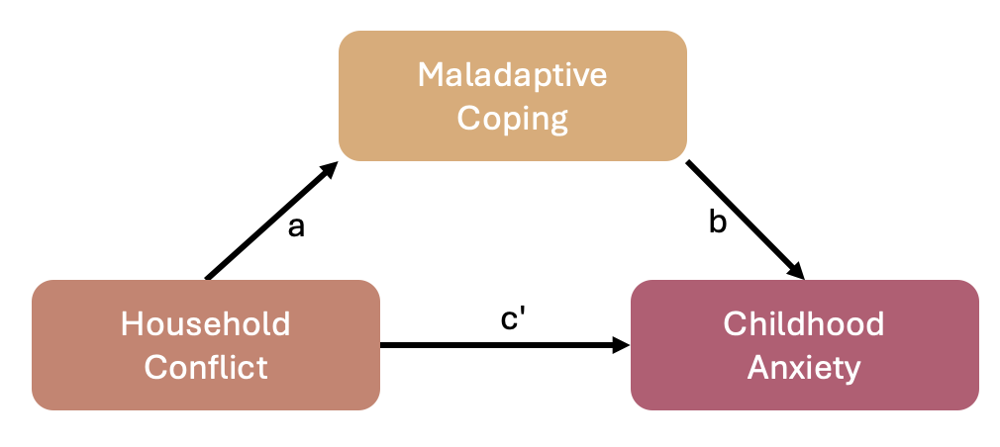
```

]

---
### Path a

$$MaladaptiveCoping_i = \beta_0 + \beta_1Conflict_i + \epsilon_i$$

.pull-left[

```{r, echo = F, fig.align= 'center'}
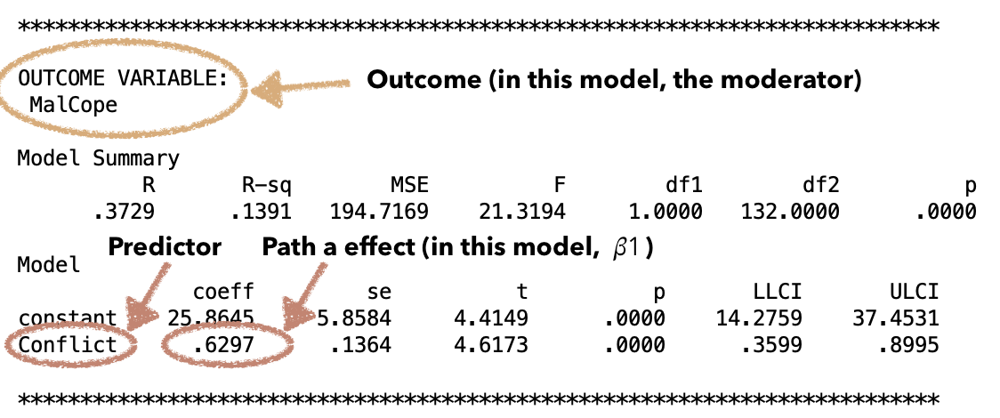
```

]

.pull-right[

```{r, echo = F, fig.align= 'center'}
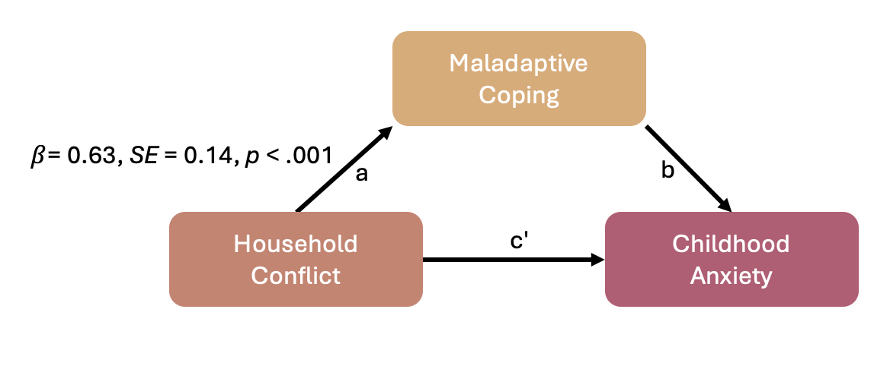
```

]

---
### Path b

$$Anxiety_i = \beta_0 + \beta_1Conflict_i + \beta_2MaladaptiveCoping_i +\epsilon_i$$

.pull-left[

```{r, echo = F, fig.align= 'center'}
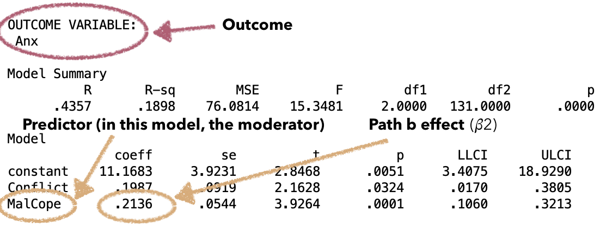
```

]

.pull-right[

```{r, echo = F, fig.align= 'center'}
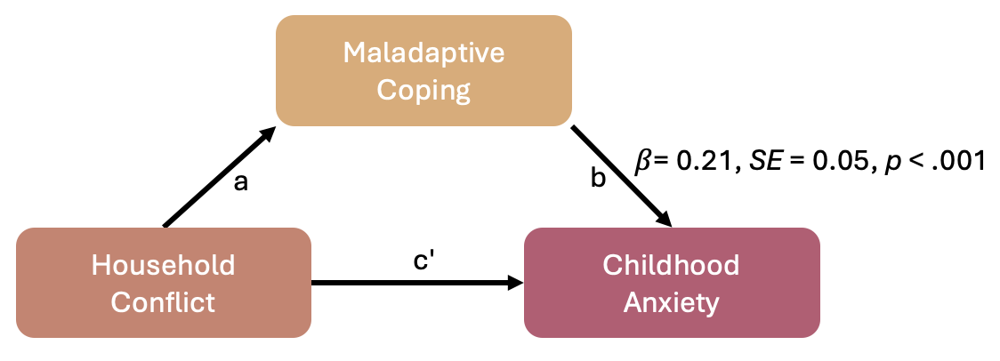
```

]

---
### Path c'
$$Anxiety_i = \beta_0 + \beta_1Conflict_i + \beta_2MaladaptiveCoping_i +\epsilon_i$$

.pull-left[

```{r, echo = F, fig.align= 'center'}
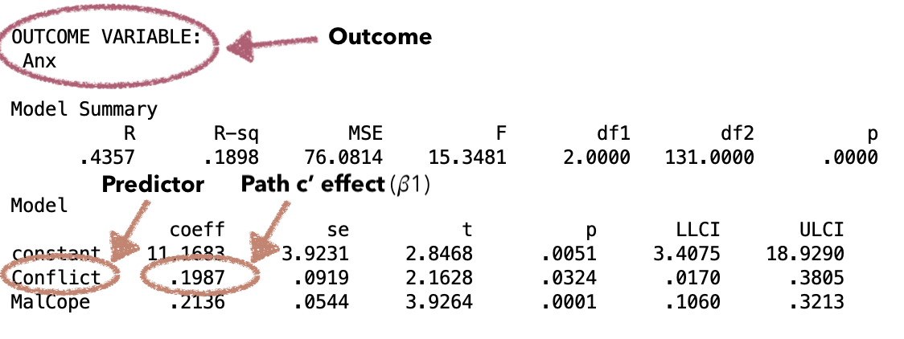
```

]

.pull-right[

```{r, echo = F, fig.align= 'center'}
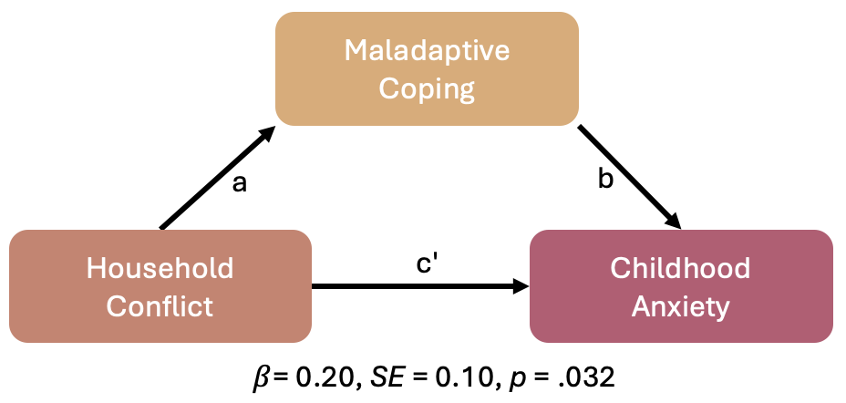
```

]

---
### Direct Effect - c'

+ The **direct** effect: the increase in the outcome that occurs with a one-unit increase in the predictor *over and above* the change that occurs via the mediator

.pull-left[
```{r, echo = F, fig.align= 'center'}
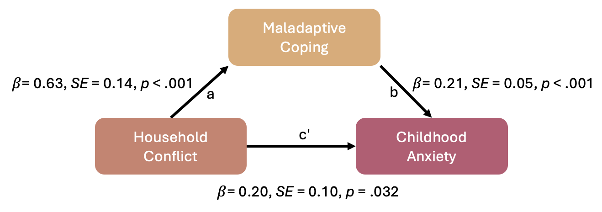
```


```{r, echo = F, fig.align= 'center'}

```

]

.pull-right[

```{r, echo = F, fig.align= 'center'}
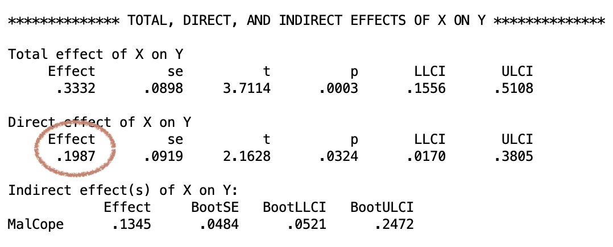
```

]
---
### Indirect Effect - $a\times b$

+ The **indirect** effect: the increase in the outcome that occurs via the mediator when the predictor increases by one unit. 

.pull-left[

```{r, echo = F, fig.align= 'center'}

```
]

.pull-right[

$$.63 \times .21 = .13$$

```{r, echo = F, fig.align= 'center'}
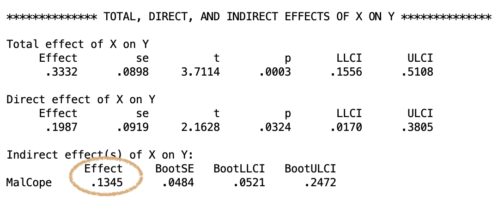
```

]

---
### Total Effect - $a \times b + c'$

+ The **total** effect: the increase in the outcome expected to occur when the predictor increases by one unit. 

.pull-left[

```{r, echo = F, fig.align= 'center'}

```

]

.pull-right[
$$(.63 \times .21) + .20 = .33$$

```{r, echo = F, fig.align= 'center'}
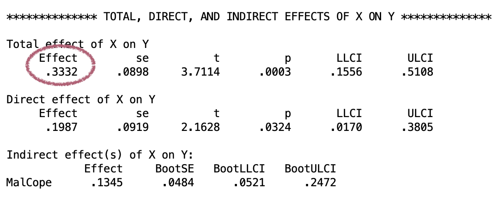
```
]

---
# An important note about mediation

+ Mediation is often considered a causal model.

+ Statistical testing is **not** sufficient to establish causality.

---
class: middle, center, inverse

## Questions?

---
### Interpreting the Indirect Effect

.pull-left[

+ The indirect effect of the mediation analysis is evaluated using bootstrapped confidence intervals rather than a $p$-value 

+ **Bootstrapping:** A statistical technique through which a parameter is estimated through the use of random resampling from a sample

]


.pull-right[
```{r, echo = F, fig.align= 'center'}

```
]

---
### A Quick Run-Through of Bootstrapping

+ Bootstrapping treats the sample as a population, and takes multiple samples from it

+ From these samples, a confidence interval for the desired parameter can be computed

--

.pull-left[
```{r, echo = F, fig.align= 'center'}
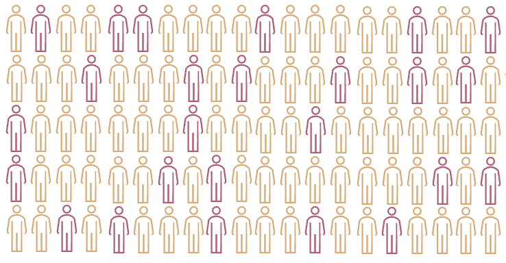
```
Imagine you have this sample.

]

---
### A Quick Run-Through of Bootstrapping

+ Bootstrapping treats the sample as a population and takes multiple samples from it

+ From these samples, a confidence interval for the desired parameter can be computed

.pull-left[
```{r, echo = F, fig.align= 'center'}
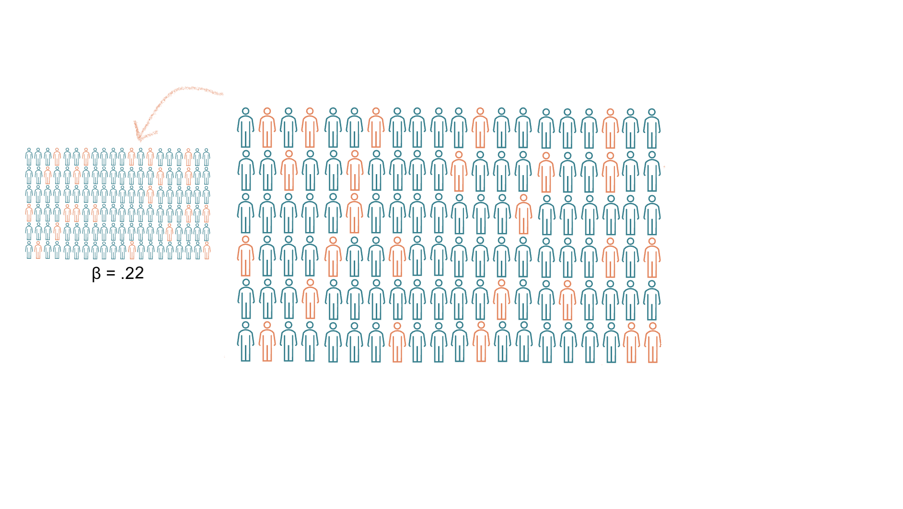
```
To bootstrap, you take a new sample with the same $n$, using **resampling**
]


.pull-right[

```{r, echo = F, fig.align= 'center', warning = F, message = F, fig.height=4}
bootDat <- data.frame(betaVals = c(.24))

ggplot(bootDat, aes(betaVals)) + geom_histogram(fill = accent1, color = accent2) + 
  scale_x_continuous(limits = c(.15, .45), breaks = seq(.15, .45, by = .05)) +
  scale_y_continuous(limits = c(0, 30), breaks = seq(0, 30, by = 5)) +
  xlab('beta')
```
...and compute the parameter of interest using the new sample. 

]

---
### A Quick Run-Through of Bootstrapping

+ Bootstrapping treats the sample as a population and takes multiple samples from it

+ From these samples, a confidence interval for the desired parameter can be computed

.pull-left[
```{r, echo = F, fig.align= 'center'}
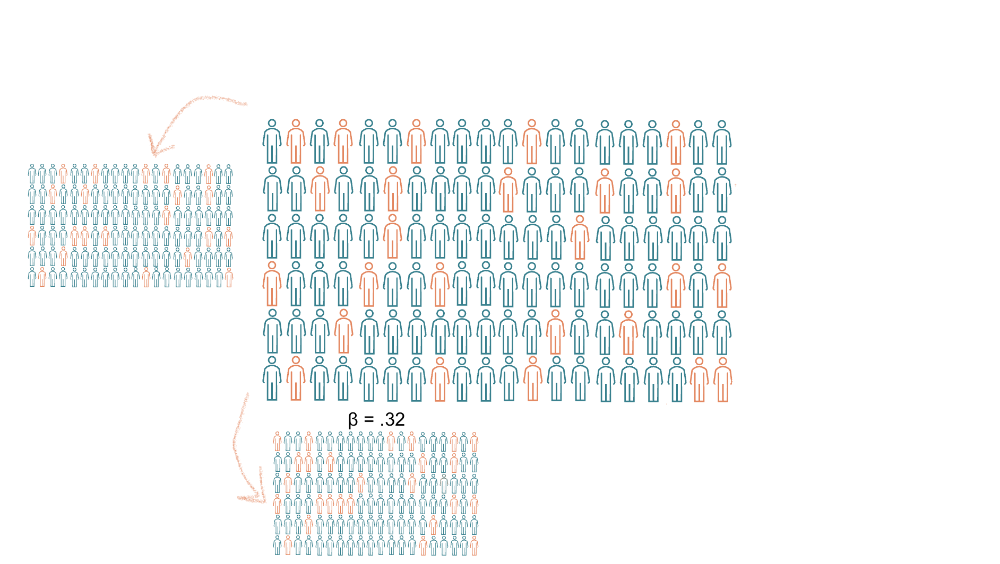
```
You do this over and over...
]

.pull-right[

```{r, echo = F, fig.align= 'center', warning = F, message = F, fig.height=4}
bootDat <- data.frame(betaVals = c(.24, .22))

ggplot(bootDat, aes(betaVals)) + geom_histogram(fill = accent1, color = accent2) + 
  scale_x_continuous(limits = c(.15, .45), breaks = seq(.15, .45, by = .05)) +
  scale_y_continuous(limits = c(0, 30), breaks = seq(0, 30, by = 5)) +
  xlab('beta')
```
...and compute the parameter of interest each time.

]

---
### A Quick Run-Through of Bootstrapping

+ Bootstrapping treats the sample as a population and takes multiple samples from it

+ From these samples, a confidence interval for the desired parameter can be computed

.pull-left[

```{r, echo = F, fig.align= 'center'}
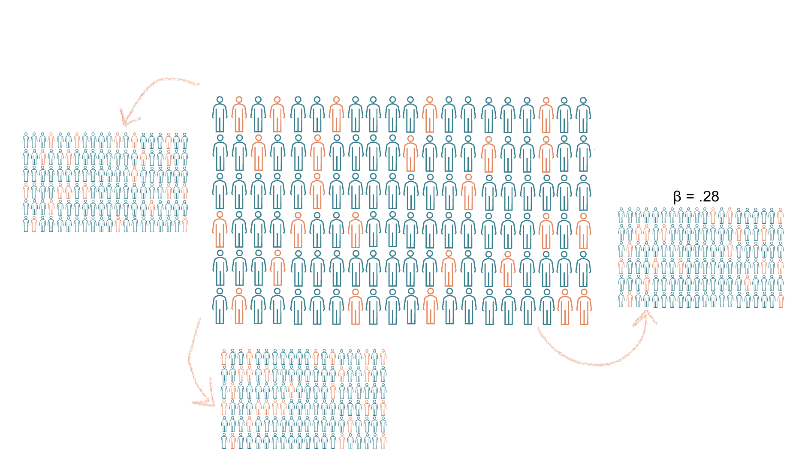
```
You do this over and over...
]

.pull-right[

```{r, echo = F, fig.align= 'center', warning = F, message = F, fig.height=4}
bootDat <- data.frame(betaVals = c(.24, .22, .28))
#.30

ggplot(bootDat, aes(betaVals)) + geom_histogram(fill = accent1, color = accent2) + 
  scale_x_continuous(limits = c(.15, .45), breaks = seq(.15, .45, by = .05)) +
  scale_y_continuous(limits = c(0, 30), breaks = seq(0, 30, by = 5)) +
  xlab('beta')
```
...and compute the parameter of interest each time.

]

---
### A Quick Run-Through of Bootstrapping

+ Bootstrapping treats the sample as a population and takes multiple samples from it

+ From these samples, a confidence interval for the desired parameter can be computed

.pull-left[
```{r, echo = F, fig.align= 'center'}
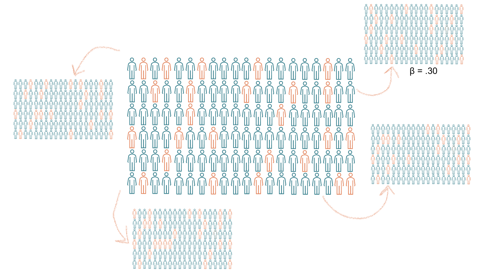
```
You do this over and over...
]

.pull-right[

```{r, echo = F, fig.align= 'center', warning = F, message = F, fig.height=4}
bootDat <- data.frame(betaVals = c(.24, .22, .28, .24))

ggplot(bootDat, aes(betaVals)) + geom_histogram(fill = accent1, color = accent2) + 
  scale_x_continuous(limits = c(.15, .45), breaks = seq(.15, .45, by = .05)) +
  scale_y_continuous(limits = c(0, 30), breaks = seq(0, 30, by = 5)) +
  xlab('beta')
```
...and compute the parameter of interest each time.

]

---
### A Quick Run-Through of Bootstrapping


+ This process is repeated over and over until there is a distribution of your parameter of interest:

```{r, echo = F, fig.align= 'center', message = F, warning = F, fig.height=4}
set.seed(405)
bootDat <- data.frame(betaVals = rnorm(500, mean = .25, sd = .1))

(bootDist <- ggplot(bootDat, aes(betaVals)) + geom_histogram(fill = accent1, color = accent2) + 
  labs(x = 'beta', y = 'Count') +
  scale_x_continuous(limits = c(0, .55), breaks = seq(0, .55, by = .05)) + 
  scale_y_continuous(limits = c(0, 55), breaks = seq(0, 55, by = 10)))
```


---
### A Quick Run-Through of Bootstrapping

+ This process is repeated over and over until there is a distribution of your parameter of interest:

```{r, echo = F, fig.align= 'center', message = F, warning = F, fig.height=4}
qts <- round(quantile(bootDat$betaVals, probs = c(0.05, .95)),2)

bootDist +
  geom_vline(xintercept = qts[1], color = accent1, linewidth = 1, lty = 2) +
  geom_vline(xintercept = qts[2], color = accent1, linewidth = 1, lty = 2) +
  annotate(geom = 'text', label = paste0('95% CI = [', qts[1], ', ', qts[2], ']'), x = 0.3, y = 50)

```

+ From this distribution, the confidence interval can be computed.

---
class: inverse, middle, center

## Questions?

---
### State your hypothesis

+ As before, the hypothesis should name all relevant variables:

+ E.g. 'The effect of X (predictor) on Y (outcome) is mediated by M (mediator).'

--

+ Statistically, you are still investigating $\beta$ values.

+ With mediation, the key result of interest is the indirect effect:

$$\beta_{indirect} \neq 0$$
---
### Power Analysis

+ Often done by simulating data with similar characteristics and performing bootstrapping to determine the sample size necessary to detect a specific effect.

 + More detail is beyond the scope of this course, but click [here](https://nickch-k.github.io/EconometricsSlides/Week_08/Power_Simulations.html) if you'd like an overview.


+ There is an [online application](https://schoemanna.shinyapps.io/mc_power_med/) that will do this for basic mediation models (See [Schoemann et al., 2017](https://journals.sagepub.com/doi/10.1177/1948550617715068)).
  + You should select correlations and standard deviation values for each variable through a search of relevant literature.

+ For this course, you can either use the app or refer to a study that has performed power analysis simulation and proposed target sample sizes for a range of effects:
  + [Sim et al. (2021)](https://pmc.ncbi.nlm.nih.gov/articles/PMC8725051/)
  + [Fritz & MacKinnon (2007)](https://pmc.ncbi.nlm.nih.gov/articles/PMC2843527/)

---
### Check Assumptions

+ Basic mediation models have the same assumptions as linear regression

+ These assumptions can be checked on the individual regression models that comprise the mediation analysis

+ We can continue in SPSS using [these data](https://mtruelovehill.github.io/ISAP/Data/parentalConflict.sav)

---
### Reporting Example

Sample data, descriptive data, and assumptions checks can be reported as in previous weeks. Here is an example of how mediation may be reported:

Mediation analysis with PROCESS macro Version 5.0 (Hayes, 2025) was used to investigate the hypothesis that maladaptive coping mechanisms mediate the effect of parental conflict on anxiety in children. Results showed that parental conflict was a significant predictor of maladaptive coping, $\beta$ = 0.63, $SE$ = 0.14, $p$ < .001, indicating that as parental conflict increased, so too did maladaptive coping mechanisms. Both parental conflict, $\beta$ = .20, $SE$ = 0.09, $p$ = .032, and maladaptive coping, $\beta$ = 0.21, $SE$ = 0.05, $p$ < .001, positively predicted childhood anxiety, explaining 19% of its variance, $F$(2, 131) = 15.35, $p$ < .001.

The indirect effect was tested using a percentile bootstrap estimation approach with 5000 samples. These results indicated the indirect coefficient was significant, $\beta$ = 0.13, $SE$ = 0.05, 95% CI[0.05,0.25]. Specifically, parental conflict increased maladaptive coping mechanisms, and these mechanisms led to an increase in childhood anxiety. However, parental conflict remained a significant predictor of childhood anxiety even after controlling for maladaptive coping ( $p$ = .032), indicating only partial mediation. In other words, parental conflict influences childhood anxiety through additional mechanisms, rather than solely through its impact on maladaptive coping.


---
class: middle, inverse, center

## Questions?

