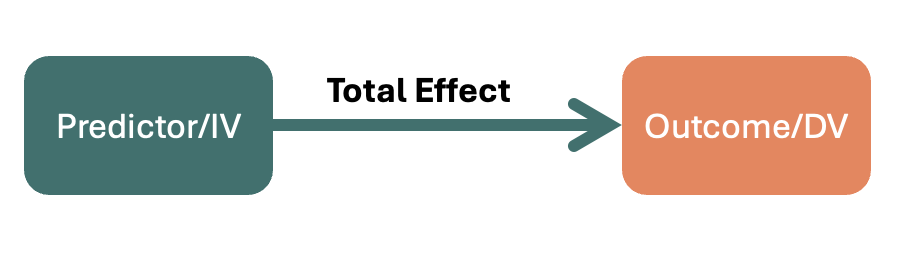
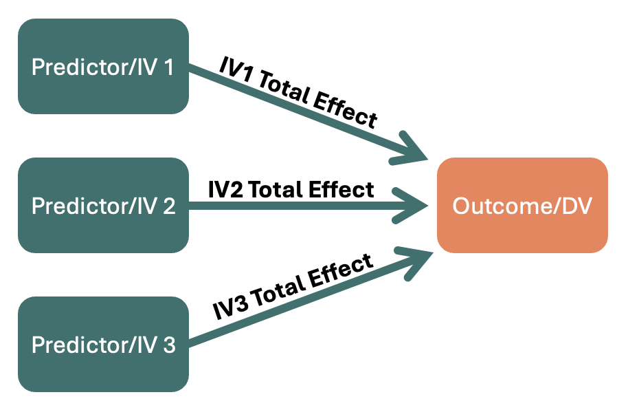
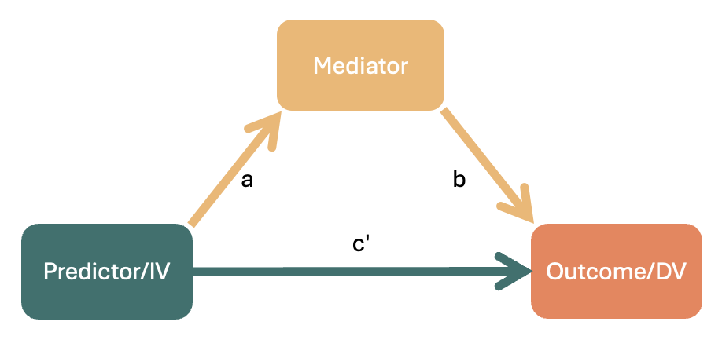
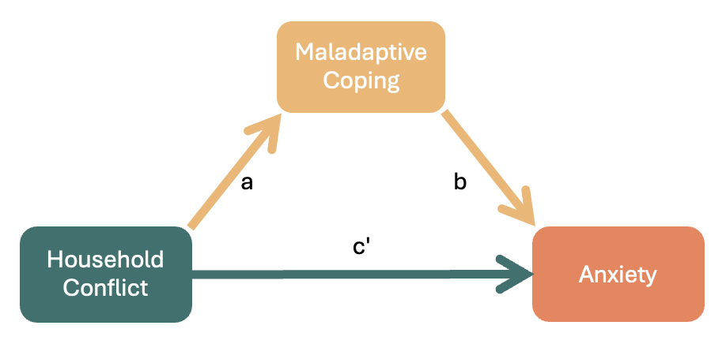

```{r setup, include=FALSE}
options(htmltools.dir.version = FALSE)
```

```{r xaringan-themer, include = FALSE}
library(xaringanthemer)
style_mono_accent(
  base_color = "#F28157",
  header_color = "#000000",
  header_font_google = google_font("Jost"),
  header_font_weight = 500,
  text_font_google = google_font("Jost", "300", "300i", "500", "500i"),
  code_font_google = google_font("Source Code Pro"),
  text_bold_color = '#F28157',
  text_slide_number_color = '#F2B66D',
  text_font_size = '16pt'
)
```

```{r, echo = F, message = F, warning = F}
library(tidyverse)
library(kableExtra)

knitr::opts_chunk$set(dev = 'svg')

baseColor <- '#F28157'
accent1 <- '#F2B66D'
accent2 <- '#30726E'
accent3 <- '#008290'
```

### This Week's Key Topics

+ Moderation vs mediation

+ Direct, indirect, and total effects

+ Steps of mediation

+ Interpreting and reporting the results of a mediation analysis


---
### Review of Previous Models

.pull-left[
Model with a single IV:

```{r, echo = F, fig.align= 'center'}

```
]

--

.pull-right[
Model with multiple IVs:
```{r, echo = F, fig.align= 'center'}

```
]

---
### Review of Previous Models

.pull-left[
Moderation/Interaction between 2 predictors/IVs:
```{r, echo = F, fig.align= 'center'}

```

<b>Total effect</b> = Effect of Predictor A + Effect of Predictor B + Interaction between A & B
]

--

.pull-right[
When an interaction occurs:

+ The effect of <span style = "color:#30726E"><b>Predictor A</b></span> on the <span style = "color:#F28157"><b>outcome</b></span> <i> changes</i> based on the value of <span style = "color:#F2B66D"><b>Predictor B</b></span>.

+ <span style = "color:#30726E"><b>Predictor A</b></span> has a direct association with the <span style = "color:#F28157"><b>outcome</b></span>, but the strength and direction of this association varies depending on <span style = "color:#F2B66D"><b>Predictor B</b></span>.

]

---
### Introduction to Mediation

.pull-left[
```{r, echo = F, fig.align= 'center'}

```
]

--

.pull-right[
When mediation occurs:

+ The effect of the <span style = "color:#30726E"><b>predictor</b></span> on the <span style = "color:#F28157"><b>outcome</b></span> is (at least partially) <i> through </i> the <span style = "color:#F2B66D"><b>mediator</b></span>.

+ The <span style = "color:#30726E"><b>predictor</b></span> may have some direct association with the <span style = "color:#F28157"><b>outcome</b></span>, but it also may not; the relationship may be entirely explained by the <span style = "color:#F2B66D"><b>mediator</b></span>.

]

---
### Introduction to Mediation

.pull-left[
```{r, echo = F, fig.align= 'center'}

```
]

.pull-right[
When mediation occurs:

+ The effect of the <span style = "color:#30726E"><b>predictor</b></span> on the <span style = "color:#F28157"><b>outcome</b></span> is (at least partially) <i> through </i> the <span style = "color:#F2B66D"><b>mediator</b></span>.

+ The <span style = "color:#30726E"><b>predictor</b></span> may have some direct association with the <span style = "color:#F28157"><b>outcome</b></span>, but it also may not; the relationship may be entirely explained by the <span style = "color:#F2B66D"><b>mediator</b></span>.

$$Proportion\ Mediated = \frac{effect\ via\ mediator}{total\ effect\ on\ outcome}$$
+ Larger mediating effects suggest that a greater proportion of the relationship between the predictor on the outcome is explained by the mediator (rather than the predictor itself)

]

---
### Key Mediation Effects

.pull-left[

```{r, echo = F, fig.align= 'center'}

```

.center[
**Total Effect = Indirect Effect + Direct Effect**
]]

.pull-right[

+ **Total:** The full effect of the predictor on the outcome 
$$a*b + c'$$
]
---
### Key Mediation Effects

.pull-left[

```{r, echo = F, fig.align= 'center'}

```

.center[
**Total Effect = Indirect Effect + Direct Effect**
]]

.pull-right[

+ **Total:** The full effect of the predictor on the outcome 
$$a*b + c'$$

> **Test Your Understanding:** Have a look at the diagram, and compare it to the equation above. Which part of the above equation reflects the direct effect? Which part reflects the indirect effect?

]

---
### Key Mediation Effects

.pull-left[

```{r, echo = F, fig.align= 'center'}

```

]

.pull-right[

+ Total: The full effect of the predictor on the outcome
$$a*b + c'$$

+ **Indirect:** The effect of the predictor on the outcome that is due to the mediator
$$a*b$$

]

---
### Key Mediation Effects

.pull-left[

```{r, echo = F, fig.align= 'center'}

```

]

.pull-right[

+ Total: The full effect of the predictor on the outcome 
$$a*b + c'$$

+ Indirect: The effect of the predictor on the outcome that is due to the mediator 
$$a*b$$

+ **Direct:** The effect of the predictor that's left after the effect of the mediator is accounted for 
$$c'$$

]


---
class: center, inverse, middle

## Questions?

---
### The Logic Behind Mediation Analysis

+ If mediation is present:

  + There should be a relationship between the predictor and the outcome
  + There should be a relationship between the predictor and the mediator
  + The presence of the mediator should weaken the association between the predictor and the outcome.
  
+ These ideas can be tested using regression models
  
--

+ A mediation analysis is a combination of regressions:

$$Mediator\sim \beta_0 + \beta_1Predictor$$
$$Outcome\sim \beta_0 + \beta_1Predictor + \beta_2Mediator$$

---
### Mediation Analysis: Under the Hood

.pull-left[
+ Recall that the direct effect is the effect of the predictor that's left after the effect of the mediator is accounted for ( $c'$)

+ $c'$ is reflected by $\beta_1$ from the following model:

$$Outcome \sim \beta_0 + \color{#30726E}{\beta_1}Predictor + \beta_2Mediator$$

]

.pull-right[
```{r, echo = F, fig.align= 'center'}

```
]

---
### Mediation Analysis: Under the Hood

.pull-left[
+ The indirect effect is the effect of the predictor that occurs via the mediator ( $a*b$)

+ $a$ is reflected by $\beta_1$ from this model:

$$Mediator \sim \beta_0 + \color{#30726E}{\beta_1}Predictor$$
+ $b$ is reflected by $\beta_2$ from this model:
$$Outcome \sim \beta_0 + \beta_1Predictor + \color{#30726E}{\beta_2}Mediator$$

]

.pull-right[
```{r, echo = F, fig.align= 'center'}

```
]

---
### In-Class Example

.pull-left[
+ `Conflict`: Conflict in the household; higher numbers = more conflict

+ `MalCope`: Maladaptiveness of child's coping mechanisms; higher numbers = more maladaptive

+ `Anx`: Child's anxiety levels; higher numbers = higher anxiety
]

.pull-right[

```{r, echo = F, fig.align= 'center'}

```

]
---
### SOME FAKE REGRESSION RESULTS TO ILLUSTRATE

---
### What's happening with a mediation analysis?

+ BOOTSTRAPPING

---
### Interpreting mediation results

MONICA - direct interpretations

---
### Full versus Partial Mediation

## DIAGRAMS FOR EACH

---
### Making model modifications

+ THIS IS WORD-FOR-WORD FROM DAPR SO IT SHOULD BE EDITED/PARAPHRASED BETTER 

    You may want to make some modifications to your initially hypothesized model
        non-significant paths that you want to trim
        include some additional paths not initially included

    As soon as we make a modification, we are no longer testing a model in a confirmatory way.
        Our analysis switches to being led by the data, not the theory.
        This is why it is generally not preferred.

    If we do:
        Model modifications should be substantively as well as statistically justifiable
        You must be aware of the possibility that you are capitalizing on chance
        You should aim to replicate the modifications in independent data

---
### Cautions regarding path mediation

+ THIS IS WORD-FOR-WORD FROM DAPR SO IT SHOULD BE EDITED/PARAPHRASED BETTER 

    We are going to talk about path mediation models, but these should only really be used with longitudinal data.

    Consider our example:
        Conscientiousness (X) affects health (Y) via health behaviors (M)

    This only really makes sense if we say:
        We believe people have varying levels of Conscientiousness
        This will lead them to behave in specific health related ways
            And these behaviors will subsequently have a health impact

    This happens over time. So to test it, we need longitudinal data.
        X time 1
        M time 2
        Y time 3

---
### Cautions: Indistinguishable models

+ THIS IS WORD-FOR-WORD FROM DAPR SO IT SHOULD BE EDITED/PARAPHRASED BETTER 

    Of course it is possible to do on cross-sectional data, but there is a big conceptual problem.
        We are modelling correlations.
        When we only have cross-sectional data, we have multiple indistinguishable models
        So there is nothing to demonstrate one model is better than another.


---
## INCLASS EXAMPLE

---
### Power Analysis

+ Beyond the scope of the course (requires data simulation and bootstrapping...provide a resource if they want to self-study)
+ Refer to ARTICLE HERE FOR THRESHOLDS

